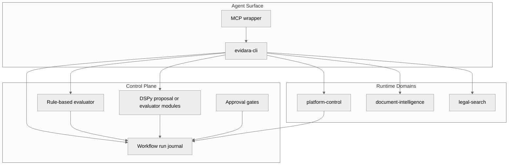

# Agentic CLI Workflow Architecture

## Status

Proposed. This document describes a planned architecture for agent- and operator-driven workflows across Evidara. It does not describe current production behavior unless a section explicitly says so.

## Purpose

Define a safe, auditable architecture for running cross-component workflows through a bounded CLI and MCP surface while preserving Evidara's existing ownership boundaries:

- `platform-control` remains the control-plane system of record.
- `document-intelligence` remains the processing engine.
- `legal-search` remains the user-facing serving layer.
- `tools/evidara-cli` remains a thin operator and agent surface over existing APIs and repo-owned workflows.

The goal is to let agents act step by step, get feedback after every action, recover from failures, and improve narrow decision-making tasks over time without turning the platform into a general-purpose autonomous agent runtime.

## Context

Evidara already has a useful foundation for this design:

- `tools/evidara-cli` provides JSON-first commands for operators and agents.
- `platform-control` already owns runs, approvals, and workflow state for operational flows.
- The architecture already recognizes feedback loops between serving, processing, and control-plane systems.

What is missing is a consistent pattern for:

- stepwise workflow execution across multiple components
- durable checkpoints and evidence capture
- explicit compensation or recovery semantics
- a narrow place to apply learning and optimization for bounded agent decisions

## Goals

- Give agents one bounded action surface through MCP-wrapped CLI commands.
- Return structured, machine-readable feedback after every step.
- Persist workflow runs and step outcomes in a durable run journal.
- Separate read-only reasoning backtracking from compensating side effects.
- Require explicit human approval before irreversible or governance-significant actions.
- Reuse existing component APIs and contracts instead of inventing parallel business logic.
- Allow narrow learning loops for proposal and evaluation tasks when representative data and metrics exist.

## Non-goals

- A general-purpose agent orchestration platform for arbitrary tasks
- Replacing `platform-control` as the system of record for workflow state
- Mirroring every OpenAPI operation in `evidara-cli`
- Letting learned models directly own approvals or irreversible mutations
- Hiding business side effects behind opaque autonomous planning

## Design Principles

1. Use the CLI as the action surface, not as the business system of record.
2. Keep domain ownership unchanged; orchestration does not move legal-search or DI responsibilities into the CLI.
3. Return evidence-rich JSON after every step.
4. Treat side effects as first-class lifecycle events with explicit recovery policies.
5. Favor idempotent commands and deterministic identifiers for mutating actions.
6. Gate irreversible actions with human approval.
7. Use rules first and learning second.
8. Keep contracts authoritative in `contracts/` when new APIs or event shapes are introduced.

## Architecture Overview



## Layer Responsibilities

| Layer | Responsibility | Does not own |
|---|---|---|
| MCP wrapper | Expose bounded tool calls to agents | Business rules, workflow durability |
| `tools/evidara-cli` | Command routing, JSON envelopes, evidence collection, local orchestration helpers | Durable workflow truth, domain state |
| `platform-control` | Durable workflow runs, approvals, audit trail, optional long-running orchestration | Search serving, canonical document truth |
| `document-intelligence` | Processing and canonicalization | Workflow planning, approval policy |
| `legal-search` | Search and detail verification surfaces | Control-plane orchestration |
| Evaluator | Decide `pass`, `retry`, `replan`, or `needs-human` using explicit rules | Domain ownership, durable mutation authority |
| DSPy module | Improve bounded proposal or scoring tasks with eval-driven optimization | Irreversible control decisions |

## Control Surface Pattern

The agent-facing control pattern should be based on a small verb family:

- `inspect`
- `propose`
- `apply`
- `verify`
- `compensate`

This is intentionally narrower than exposing every underlying API operation. The CLI should wrap only:

- stable operator verbs
- repeated golden paths
- repo-owned scripts and short HTTP sequences
- verification surfaces that produce evidence for agents or humans

## Proposed CLI Command Tree

The CLI should group commands by workflow rather than by raw service only.

Illustrative structure:

```text
evidara workflow source inspect
evidara workflow source propose-spec
evidara workflow source create-draft
evidara workflow source run-preview
evidara workflow source verify-preview
evidara workflow source request-approval
evidara workflow source verify-serving
evidara workflow source compensate

evidara workflow search inspect
evidara workflow search verify-query-pack
evidara workflow search verify-document-detail

evidara workflow document inspect-processing
evidara workflow document verify-canonical-state
evidara workflow document verify-serving

evidara workflow run status
evidara workflow run resume
evidara workflow run cancel
evidara workflow run evidence
```

Expected usage pattern:

- `inspect`: read-only checks and discovery
- `propose-*`: draft plans, specs, or operator-facing summaries
- `create-*` or `run-*`: mutating actions
- `verify-*`: post-action evidence collection and rule-based evaluation
- `compensate`: explicit recovery or superseding action

## Step Contract

Every workflow command should return a consistent JSON envelope.

Example shape:

```json
{
  "ok": true,
  "workflow": "source-preview",
  "run_id": "wf_20260408_123",
  "step": "preview.verify",
  "status": "passed",
  "side_effect_level": "reversible",
  "inputs": {
    "source_id": "src_123",
    "preview_run_id": "pr_456"
  },
  "artifacts": {
    "captured_resource_count": 42
  },
  "evidence": [
    {
      "kind": "http",
      "target": "platform-control:/v1/runs/pr_456",
      "status_code": 200
    }
  ],
  "decision": {
    "recommended_action": "approve",
    "reason": "Preview captured PDF artifacts and expected source pages"
  },
  "next_actions": [
    "approve",
    "adjust-acquisition-spec"
  ],
  "compensation": {
    "available": true,
    "command": "evidara workflow source compensate --run-id wf_20260408_123"
  }
}
```

## Envelope Field Definitions

| Field | Meaning | Notes |
|---|---|---|
| `ok` | Overall command success | `false` for transport, evaluation, or contract failures |
| `workflow` | Stable workflow family name | Example: `source-preview` |
| `run_id` | Durable workflow run identifier | Should remain stable across steps |
| `step` | Stable step identifier | Example: `preview.verify` |
| `status` | Step outcome classification | See lifecycle model below |
| `side_effect_level` | Mutation class | `none`, `reversible`, or `irreversible` |
| `inputs` | Minimal structured input echo | Avoid secrets or oversized payloads |
| `artifacts` | Key ids, counts, or refs produced by the step | Use domain identifiers where possible |
| `evidence` | Supporting facts for operator or evaluator review | HTTP checks, contract checks, object refs, counts |
| `decision` | Recommended next action and rationale | Useful for agents and humans; not final authority |
| `next_actions` | Enumerated safe continuations | Enables bounded planner branching |
| `compensation` | Recovery metadata if available | Prefer commands or durable ids over prose |

## Step Lifecycle Model

Each step should declare one side-effect class:

- `none`: read-only; safe to retry or branch freely
- `reversible`: mutating but compensatable with a supported recovery action
- `irreversible`: mutating with no guaranteed rollback; requires an approval gate before proceeding

Each step should end in one status:

- `passed`
- `failed_retriable`
- `failed_terminal`
- `needs_human`
- `compensated`

This gives the agent loop a simple policy:

1. Retry only when the step is read-only or explicitly retriable.
2. Compensate before retrying reversible side effects.
3. Pause for approval before irreversible continuation.
4. Re-plan from the last successful checkpoint, not from memory alone.

## Backtracking Model

The architecture must distinguish two different behaviors:

### Reasoning backtracking

The agent may revise its plan after reading new evidence. This is safe and expected.

Examples:

- choose a different verification query pack
- revise a proposed acquisition spec before creating a draft
- switch from automatic retry to human escalation

### Side-effect compensation

If a mutating step has already happened, the system must not pretend that "thinking harder" undoes it. Reversal must happen through an explicit compensating action.

Examples:

- reject or supersede a draft source version
- mark a preview run abandoned
- revoke an approval before downstream release
- create a corrective run instead of deleting historical evidence

## Durable Run Journal

The durable run journal should live in `platform-control`, not inside the CLI process. The CLI may cache local traces for debugging, but durable workflow state belongs in the control plane because it aligns with existing ownership for:

- runs
- approvals
- auditability
- operator visibility
- cross-service coordination

Conceptual entities:

### Workflow run

- workflow name
- environment and target surfaces
- requested-by identity
- status
- current checkpoint
- approval state
- started and finished timestamps
- top-level input summary

### Workflow step run

- workflow run id
- step name
- attempt number
- command or action name
- side-effect level
- evaluator outcome
- structured inputs and outputs
- evidence refs
- correlation id
- compensation availability
- started and finished timestamps

If this design is implemented, the canonical API shape must be defined in `contracts/api/platform-control.openapi.yaml` rather than only in prose.

## Proposed Control-Plane Workflow Surfaces

These are proposed future surfaces, not current endpoints:

- `POST /v1/workflows/runs`
- `GET /v1/workflows/runs/{run_id}`
- `GET /v1/workflows/runs/{run_id}/steps`
- `POST /v1/workflows/runs/{run_id}/steps`
- `POST /v1/workflows/runs/{run_id}/resume`
- `POST /v1/workflows/runs/{run_id}/cancel`
- `POST /v1/workflows/runs/{run_id}/approve`
- `POST /v1/workflows/runs/{run_id}/compensate`

Proposed response responsibilities:

- `platform-control` owns durable state, approval state, and auditability
- `evidara-cli` owns command ergonomics and evidence assembly for local or agent use
- agents consume only the bounded CLI or MCP tool surface, not the raw workflow journal APIs directly unless explicitly needed for operator tools

## Evaluator Design

The evaluator should be rule-based by default.

Evaluator responsibilities:

- check HTTP status and contract-shaped response fields
- validate minimum completeness thresholds
- classify failures into retryable vs terminal
- recommend `retry`, `replan`, `needs-human`, or `continue`
- write its outcome to the workflow journal

The evaluator should remain deterministic for governance-sensitive decisions. Learned models may assist with scoring or summarization, but the final gate for high-impact actions should remain explicit.

## DSPy Role

DSPy is a fit for bounded cognitive tasks inside the workflow, not for durable orchestration itself.

Good first candidates:

- propose acquisition spec from a seed URL and sampled metadata
- summarize preview diffs for an operator
- classify likely failure cause from captured logs and step traces
- choose a verification query pack for a source family

Poor candidates:

- approval authority
- compensation authority
- irreversible side-effect policy
- audit-trail truth

The rule is simple: use DSPy only where there is a clear input, a clear output, and a measurable quality signal.

## Learning Loop

Learning should follow an explicit promotion pipeline:

1. Capture proposal inputs, outputs, human edits, and eventual outcomes in the run journal.
2. Build an eval set from accepted, rejected, and corrected cases.
3. Optimize one bounded DSPy module against that eval set.
4. Run the improved module in shadow mode alongside the current baseline.
5. Promote only if offline evaluation and shadow results improve without creating new safety risks.

This keeps learning auditable and avoids coupling workflow correctness to opaque prompt iteration.

## Example Workflow: Source Draft To Search Verification

This workflow is a good first target because it crosses all major runtime domains while still mapping to existing control-plane concepts.

### Step 1: Inspect

- Verify target environment reachability.
- Check for likely duplicate source identities.
- Fetch reference data needed for source creation.
- Record read-only evidence.

### Step 2: Propose spec

- Build a draft acquisition spec from the seed URL and sampled content.
- Optionally use a DSPy module for proposal quality.
- Return confidence and rationale, but do not mutate state yet.

### Step 3: Create draft

- Create a draft source or source version in `platform-control`.
- Use idempotency keys or deterministic request labels.
- Record the created identifiers in the journal.

### Step 4: Run preview

- Trigger a preview run through `platform-control`.
- Capture run id, request metadata, and any provider job identifiers.

### Step 5: Verify preview

- Check run completion status.
- Verify that expected content classes were captured.
- Classify failure causes with explicit rules first.
- Optionally produce a DSPy-generated operator summary.

### Step 6: Request approval

- Pause for operator review.
- Persist approval state in the journal and control plane.
- Do not continue automatically past this boundary.

### Step 7: Verify downstream serving

- After approval and downstream processing, run `legal-search` search and detail checks.
- Reuse CLI-owned verification commands rather than ad hoc HTTP probing.
- Record evidence for search hit count, detail fetch success, and contract-shaped fields.

### Step 8: Compensate or close

- If verification fails after a reversible action, run a supported compensation path.
- If the run is successful, mark the workflow complete with the final checkpoint and evidence summary.

## Durability Options

Two durability modes are expected:

### Phase 1: Synchronous CLI-led workflows

Use the CLI for short-running command sequences and persist run and step state in `platform-control`.

Best for:

- local development smoke
- operator-assisted workflows
- short verification sequences

### Phase 2: Control-plane durable workflows

When a workflow requires waiting, resuming, or signal-driven progression, move orchestration durability into `platform-control` and its orchestration backend rather than keeping long-lived shell processes open. This aligns well with the existing workflow/orchestrator direction already present in `platform-control`.

Best for:

- approval waits
- long-running preview or ingestion paths
- multi-step retries over hours or days
- signal-driven progression from external systems

## Security And Governance

- Agents should receive only bounded MCP tools, not unrestricted raw service access.
- Each mutating step should carry a correlation id for audit and traceability.
- Approval gates should remain mandatory for irreversible or governance-significant transitions.
- Human-readable summaries may be generated, but durable decisions must be backed by explicit structured evidence.

## Observability

Each step should emit:

- structured logs
- correlation ids
- workflow run id and step id
- timing data
- evaluator outcome
- evidence refs or summaries

This enables postmortems, replay analysis, and training-data extraction for bounded learning tasks.

## Testing Strategy

### Unit tests

- step envelope generation
- evaluator rules
- retry and compensation policy
- idempotency behavior for mutating commands

### Contract tests

- workflow journal API once introduced
- command output JSON envelope stability
- any new control-plane workflow endpoints

### Smoke tests

- one end-to-end workflow through inspect, propose, apply, verify
- failure path with explicit compensation
- approval gate pause and resume behavior

### Learning and evaluation tests

- fixed eval sets for each DSPy-assisted module
- baseline versus candidate comparison before promotion
- shadow-mode capture for new model or prompt variants

## Implementation Workstreams

| ID | Workstream | Scope | Primary owner |
|---|---|---|---|
| ACW-001 | Normalize CLI envelopes | Add `run_id`, `step`, `status`, `side_effect_level`, `evidence`, and `next_actions` to workflow-oriented commands | `tools/evidara-cli` |
| ACW-002 | Add evaluator layer | Introduce reusable rule-based verdict helpers for workflow checks | `tools/evidara-cli` |
| ACW-003 | Define journal contracts | Add proposed workflow-run and step-run APIs to `contracts/api/platform-control.openapi.yaml` when implementation starts | `contracts` + `platform-control` |
| ACW-004 | Persist workflow journal | Add durable run and step models plus read surfaces in `platform-control` | `platform-control` |
| ACW-005 | Add approval and compensation flow | Persist approval state and compensation actions for reversible steps | `platform-control` |
| ACW-006 | Deliver first golden path | Implement source inspect, proposal, draft creation, preview run, and preview verification | `tools/evidara-cli` + `platform-control` |
| ACW-007 | Add operator visibility | Expose workflow journal and evidence in operator-facing read surfaces | `platform-control` React-admin app |
| ACW-008 | Add one DSPy module | Start with `propose-spec` or preview summarization plus eval set and shadow mode | bounded AI module |

## Backlog

| ID | Task | Output |
|---|---|---|
| ACW-009 | Define stable workflow step ids | Shared naming convention for journal entries and CLI responses |
| ACW-010 | Add idempotency strategy | Request labels or idempotency keys for mutating workflow commands |
| ACW-011 | Add workflow smoke suite | Narrow smoke coverage for happy path and compensation path |
| ACW-012 | Add evidence refs | Stable evidence payload format for HTTP, contracts, artifacts, and logs |
| ACW-013 | Add approval-gate UX | Operator-facing pause and resume flow |
| ACW-014 | Build first eval set | Accepted versus corrected proposal examples for DSPy candidates |
| ACW-015 | Add shadow evaluation path | Baseline versus candidate tracking for learned modules |

## Rollout Plan

### Phase 0: Normalize CLI output

- add `run_id`, `step`, `evidence`, `next_actions`, and `side_effect_level` to workflow-oriented CLI commands
- keep storage local or ephemeral while stabilizing the envelope

### Phase 1: Add durable journal in `platform-control`

- persist workflow runs and steps
- expose operator read surfaces
- attach approval state and correlation ids

### Phase 2: Add one golden-path workflow

- implement source draft to preview verification through the bounded command family
- add compensation rules and smoke coverage

### Phase 3: Add one DSPy module

- start with `propose-spec` or preview summarization
- add offline eval and shadow mode before promotion

### Phase 4: Extend durable orchestration only where needed

- move long-lived waits and signal-driven steps into `platform-control` orchestration
- do not create a separate generic agent runtime unless a concrete need appears

## Risks And Tradeoffs

| Risk | Mitigation |
|---|---|
| CLI grows into a second business API | Keep it workflow-oriented and thin over existing systems |
| Agent retries duplicate side effects | Require idempotency and explicit compensation metadata |
| Learned modules influence high-stakes actions too early | Restrict DSPy to bounded proposal and evaluation tasks |
| Journal schema drifts from actual workflow behavior | Define durable APIs in `contracts/api/` when implemented |
| Long-running workflows become brittle in shell processes | Shift durable waiting to `platform-control` orchestration |

## Open Questions

- Should the workflow journal extend existing `platform-control` run entities or introduce dedicated workflow-run entities?
- Which approval surfaces should own human interaction first: React-admin, additional APIs, or CLI-mediated operator flows?
- Which single workflow should be the first production candidate after `mvp-acceptance`?
- What minimum eval set size is required before introducing the first DSPy module?

## Recommended First Implementation Slice

Start with a single bounded workflow:

- source inspect
- source draft proposal
- draft creation
- preview run
- preview verification

This slice is small enough to test, crosses the right system boundaries, and creates the data needed to decide whether DSPy adds value for proposal quality or operator summarization.
