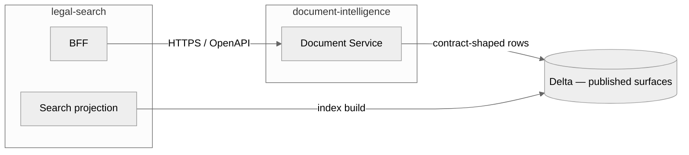

# Boundary Contracts

## Overview

Evidara has two major runtime handoff boundaries:

1. `platform-control` ↔ `document-intelligence`
2. `document-intelligence` → `legal-search`

Each boundary has a different purpose:

- `platform-control` hands off immutable acquisition input and receives operational status back
- `document-intelligence` publishes canonical-ready document revisions for downstream serving

Async transport in the live runtime is **NATS JetStream** (self-hosted; see
[ADR-0029](../adr/0029-self-hosted-hetzner-runtime.md)). The broker is an implementation
detail behind the event contracts — a Pub/Sub adapter still exists in the code and is
retained until cutover is confirmed, but it is not what runs.

## Boundary 1: platform-control ↔ document-intelligence

### What crosses this boundary

| Direction | Payload | Mechanism |
|-----------|---------|-----------|
| platform-control → document-intelligence | `artifact_bundle.available` event | Async (NATS JetStream) |
| platform-control → document-intelligence | reference snapshot sets | published file or dataset surface |
| document-intelligence → platform-control | `document.processing_status.updated` event | Async (NATS JetStream) |

### Core contract objects

- `ArtifactBundleManifest`
- `artifact_bundle.available`
- `document.processing_status.updated`

### Meaning of the handoff

When `platform-control` has durably stored one upstream snapshot and its sibling artifacts, it emits `artifact_bundle.available`.

`raw_artifact.available` may still be emitted inside `platform-control` for preview, observability, or capture workflows, but it is not the primary `document-intelligence` handoff contract.

The boundary contract is intentionally split:

- the event is the progression signal
- the bundle manifest is the immutable handoff object
- reference snapshot exports are the governed reference-data input

For canonical field-level truth, use the contract files directly:

- `contracts/events/artifact-bundle-available.schema.json`
- `contracts/schemas/artifact-bundle-manifest.schema.json`
- `contracts/common/provenance.schema.json`
- `contracts/common/manifest-ref.schema.json`

### Boundary principles

- `platform-control` owns source lifecycle, corpora, approvals, runs, and acquisition state.
- `document-intelligence` owns interpretation, normalization, and canonical truth.
- `platform-control` may freeze DI hints and override refs, but it does not choose DI implementation classes.
- `document-intelligence` must not read `platform-control`'s operational database directly.
- `document-intelligence` reports progress via status events rather than by mutating `platform-control` state directly.

### Clear ownership examples

- A website changes pagination from `page=2` to cursor tokens:
  This is `platform-control` work. Update connector config, sync strategy, checkpointing, and run behavior.
- A Swiss canton PDF needs custom heading detection:
  This is `document-intelligence` work. Update the jurisdiction or source profile logic in DI.
- A source should now default into a different corpus:
  This is `platform-control` work. Corpus assignment belongs to source governance.
- Two artifacts from the same upstream snapshot should be combined before canonicalization:
  This is `document-intelligence` work. Bundle interpretation belongs to DI once the immutable bundle exists.

## Boundary 2: document-intelligence → legal-search

### What crosses this boundary

| Direction | Payload | Mechanism |
|-----------|---------|-----------|
| document-intelligence → legal-search | `document.processed` event | Async (NATS JetStream) |
| document-intelligence → legal-search | `document.withdrawn` event | Async (NATS JetStream) |
| legal-search (BFF) → document-intelligence (Document Service) | OpenAPI document-detail reads (lean/full body from published rows) | Sync (HTTPS) |
| legal-search (search projection) | reads published canonical surfaces referenced by `published_document_ref`, `published_sections_ref`, and `processing_manifest_ref` | Sync (read, bulk indexing) |

### Core contract objects

- `ProcessingManifest`
- `Document`
- `Section`
- `document.processed`
- `document.withdrawn`

### Meaning of `document.processed`

`document.processed` is emitted once one logical document revision becomes canonical-ready.

At this boundary:

- the event is the publication signal
- the processing manifest is the immutable record of one DI result
- the published dataset refs identify the exact downstream-consumable canonical rows

The event does **not** embed the full document body and does **not** expose arbitrary internal Delta table names or paths. For canonical field-level truth, use:

- `contracts/events/document-processed.schema.json`
- `contracts/events/document-withdrawn.schema.json`
- `contracts/schemas/processing-manifest.schema.json`
- `contracts/common/dataset-ref.schema.json`
- `contracts/common/manifest-ref.schema.json`

### Published surfaces

`document-intelligence` owns internal bronze/silver organization, but downstream consumers read only published contract surfaces such as:

- `published_documents`
- `published_sections`
- `processing_manifests`

The `document.processed` event points at those surfaces through `published_document_ref`, `published_sections_ref`, and `processing_manifest_ref`, which keeps internal DI modeling evolvable without breaking `legal-search`. The `document.withdrawn` event does not expose published-surface refs; it carries only the identity fields needed for deindexing.

User-facing **document detail** in the request path goes through the **Document Service** (see [ADR-0010](../adr/0010-document-content-format.md)): the BFF calls a DI-owned read API that returns only contract-shaped content from those published surfaces, not ad hoc Delta paths.

For the current M4 slice, the in-repo `legal-search` BFF serves detail from OpenSearch first and performs a deterministic fallback to the DI Document Service only when body content is missing (`content_docling`/`content` empty). This keeps request-path behavior stable while projection and indexing continue to mature.

Canonical C4 relationships live in [`structurizr/workspace.dsl`](../../structurizr/workspace.dsl).

### Boundary principles

- `document-intelligence` owns canonical truth and document revisioning.
- `legal-search` owns all OpenSearch mappings, aliases, indexing jobs, and projection logic.
- `legal-search` must not treat OpenSearch as a source of truth.
- `legal-search` must not query arbitrary internal DI tables; the BFF uses the Document Service for request-path reads, and projection jobs read only published surfaces referenced by contracts.
- `document.processed` is emitted per document, not per bundle.

### Supersession and withdrawal

- Processing supersession flows through `document.processed` with a higher `document_revision`.
- Legal lifecycle changes such as `superseded` or `repealed` also flow through `document.processed`.
- True public-search removal flows through `document.withdrawn`.

## Scope Model

`scope_type` defines the visibility boundary for a corpus and every document lineage record inside it.

| `scope_type` | Use it for | Access semantics |
|--------------|------------|------------------|
| `global_public` | Shared public legal corpora such as official laws and regulations | Visible to all authorized product users for public content. Uses the reserved tenant such as `tenant_public`. |
| `tenant_private` | One client's internal or licensed corpus | Visible only inside that tenant boundary. Identity resolution and search routing must stay inside the tenant corpus. |
| `tenant_shared` | Controlled multi-tenant shared corpora such as curated partner libraries | Shared only across an explicitly governed set of tenants or operators; never treat as globally public by default. |

Enforcement implications:

- tenant and corpus filters are mandatory on every control-plane and search-facing boundary
- canonical identity resolution happens within a corpus boundary by default
- shared/private scope decisions must flow into indexing and access-control rules, not just source metadata

For the current M4 slice, those scope values are frozen in source-version acquisition config and copied into manifests and lifecycle events. Dedicated corpus CRUD and broader access-control surfaces remain follow-on work.

## Standards Vs Domain Contracts

Use standards and managed capabilities where they fit, but keep business semantics explicit:

- Event metadata should stay CloudEvents-aligned.
- Bundle and processing manifests should be immutable JSON objects referenced through `manifest_ref`.
- Searchable manifest metadata should be mirrored into component-owned query surfaces rather than encoded in Hive-style path semantics.
- DI-internal lineage for jobs, tables, and published views is carried by the processing manifests and the Delta table history itself; there is no external catalog service in the loop.
- OpenSearch aliases and versioned physical indices should provide search cutover and rebuild mechanics.

Evidara-specific contracts still need to own:

- `tenant_id`, `corpus_id`, and scope boundaries
- source/version/run/snapshot/artifact lineage across components
- stable `document_id`
- immutable `processing_manifest_id`
- monotonic `document_revision`
- resolution-policy and withdrawal semantics

## Contract Evolution

- Contracts are additive within a version.
- Event names stay stable; `event_version` carries the major version.
- Breaking changes require a new version and an ADR.
- New fields should be optional first unless every producer and consumer changes together.
- Example payloads in `contracts/examples/` are part of the contract surface and should evolve with the schema.
