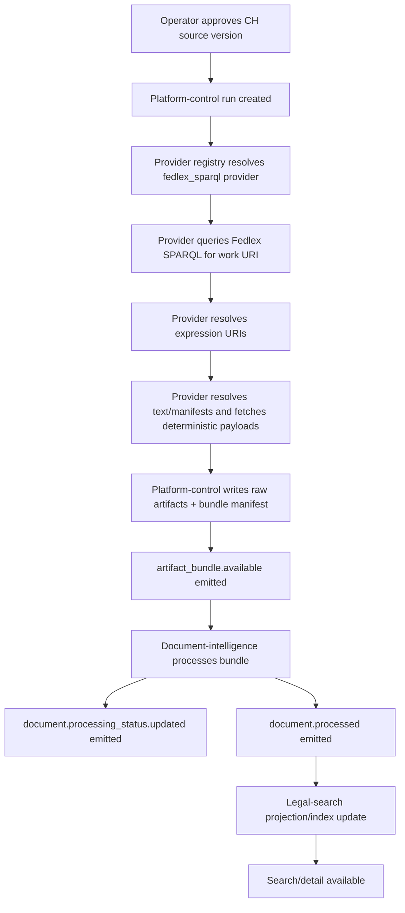
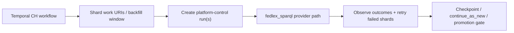

# CH Fedlex SPARQL Provider and Temporal Orchestration

## Status

Proposed implementation path for CH Fedlex after the first live deterministic thin slice on
`dev`.

## Purpose

Define the production-safe CH Fedlex architecture after the live evidence showed:

- raw `www.fedlex.admin.ch` and `fedlex.data.admin.ch` document URLs are not suitable as plain
  `deterministic_http` seeds
- the public Fedlex data surface is queryable through SPARQL
- Temporal is useful for orchestration, retries, hierarchy traversal, and backfills, but it is not
  the acquisition provider itself

This document separates:

1. `how to fetch CH Fedlex data deterministically`
2. `how to orchestrate large-scale CH scraping, retries, and backfills`

## Problem statement

The first live CH deterministic run proved the platform path works but the acquisition config is
wrong for Fedlex text capture.

Observed facts:

- `deterministic_http_fedlex_legislation` seeded `https://www.fedlex.admin.ch/`
- the run completed successfully end to end
- the captured artifact was only the Fedlex homepage shell
- direct GETs to document-looking `/eli/...` URLs still returned SPA shell content or `400`
- the Fedlex metadata app rendered real legal metadata only after browser-side query execution

At the same time, live probing confirmed:

- public SPARQL endpoint: `https://fedlex.data.admin.ch/sparqlendpoint`
- work URI example: `https://fedlex.data.admin.ch/eli/cc/1999/404`
- work -> language expressions can be resolved deterministically via SPARQL:
  - `.../de`
  - `.../fr`
  - `.../it`
  - `.../en`
  - `.../rm`

## Core decision

Use a CH/Fedlex-specific deterministic provider built on top of SPARQL resolution.

Do **not** use Firecrawl as the long-term CH production path.

Use Temporal above the provider for:

- hierarchy traversal
- shard fan-out
- retries
- resume/checkpoint behavior
- backfill windows
- optional human approval gates before widening/promotion

## Boundary: provider vs Temporal

### Provider owns

- resolving a Fedlex work URI into language expressions
- resolving expression/work nodes into text-bearing or manifestation-bearing targets
- fetching deterministic payloads
- emitting provider resources for raw artifact persistence
- preserving authoritative metadata in resource metadata/provenance

### Temporal owns

- choosing which work URIs to process
- partitioning large CH hierarchies into shards
- retrying failed shards
- resuming long-running backfills
- enforcing batch sizes and backpressure
- scheduling periodic refresh or date-window backfills
- optionally gating scale-up or promotion after a pilot shard

### Why this split is correct

The current repo already separates these concerns:

- acquisition runs are created through `POST /v1/runs`
- run dispatch uses the provider registry / connector worker
- Temporal today is used by the wizard/orchestrator path, not as the run provider

Relevant current implementation surfaces:

- provider registry: [provider_registry_factory.py](../../platform-control/src/platform_control/services/provider_registry_factory.py)
- run dispatch: [run_service.py](../../platform-control/src/platform_control/services/run_service.py)
- connector worker: [connector_worker.py](../../platform-control/src/platform_control/connector_worker.py)
- Temporal orchestrator: [orchestrator.py](../../platform-control/src/platform_control/services/orchestrator.py)
- rollout guide: [platform-control-wizard-temporal-argilla-rollout.md](../setup/platform-control-wizard-temporal-argilla-rollout.md)

## Proposed CH provider

Name suggestion:

- `fedlex_sparql`

### Minimal provider responsibilities

Given a source version acquisition spec, the provider should:

1. take one or more seed work URIs
2. query Fedlex SPARQL for the work node
3. resolve language expression URIs from `jolux:isRealizedBy`
4. choose the preferred language set from acquisition config
5. resolve text-bearing, manifestation-bearing, or section-bearing targets for those expressions
6. fetch the resolved targets deterministically
7. emit provider resources with:
   - `source_url`
   - `final_url`
   - content type
   - fetched body
   - title / metadata when available
   - provenance metadata including work URI, expression URI, language, and query mode

### In-force expression selection (#633)

A work resolves to many dated consolidations (`jolux:isMemberOf`), each carrying
its entry-into-force window:

- `jolux:dateApplicability` — first day the consolidation is in force (VERIFIED
  against the live endpoint, 2026-07-17)
- `jolux:dateEndApplicability` — last day in force; absent/open on the current
  consolidation

The provider selects the consolidation **in force at a requested date**, defaulting
to today — never simply the newest member. Taking the newest unconditionally
acquired a future consolidation ("Stand am 1. Januar 2029") on a platform whose
differentiator is temporal validity. Acquiring a future consolidation is now an
explicit, auditable act: set `acquisition_spec.as_of_date` (ISO `YYYY-MM-DD`) to a
future date.

The selected consolidation's validity window is emitted into resource metadata as
`in_force_from` / `in_force_until` (plus `selected_as_of` and
`in_force_at_selection`), so downstream four-valued in-force logic can answer
instead of reporting `unknown`. The CH Fedlex fast loop (`ch-fedlex-fast-loop.sh`)
gates on this: a future-dated or not-in-force selection fails with verdict
`acquired_law_not_in_force`.

### Act-level enforcement status (#628)

Consolidation dates describe a *version*; they do not reliably say whether the
**act** is still law. Verified against the live endpoint (2026-07-19), the
abstract work additionally carries:

- `jolux:inForceStatus` — a
  `https://fedlex.data.admin.ch/vocabulary/enforcement-status/{code}` IRI. Only
  three codes are in use: `0` = *In force*, `1` = *No longer published in the
  SR*, `3` = *No longer in force*.
- `jolux:dateEntryInForce` — the act's **original** entry into force, which is
  not the selected consolidation's start date (BV: act `2000-01-01`, current
  consolidation `2024-03-03`).

This matters because a repealed act's newest consolidation does **not** always
carry `dateEndApplicability` — measured live, 3 works with status *No longer in
force* have an open-ended newest consolidation. Consolidation dates alone would
report repealed law as currently in force, which is the confident fabrication
ADR-0033 exists to prevent. The act-level status is therefore authoritative over
an absent end date: status `3` forces `in_force_at_selection: false`, so the
canary fails closed. An unrecognised vocabulary code is reported as `null`
rather than mapped onto a plausible value.

### The population chain (#628)

Asking Fedlex for the dates is necessary but not sufficient — the window has to
survive to the document. Before this change it was dropped at two hops between
acquisition and the search projection, so federal law answered
`in_force_state: unknown` even though acquisition knew the answer:

```text
provider metadata (in_force_from/in_force_until)
  → RawArtifact.artifact_metadata.provider_metadata          [always worked]
  → bundle manifest extraction_hints                          [was dropped]
       in_force_from_hint / in_force_until_hint
  → DI document.metadata.in_force_from / .in_force_until      [was dropped]
  → search projection in_force_from (coalesces effective_date)
  → resolveInForceState() answers instead of `unknown`
```

The hints are omitted, never defaulted, when acquisition could not establish the
window: the in-force model is four-valued precisely so it can say `unknown`, and
handing it a guessed date would defeat that.

### Acquisition spec shape

The current union contains:

- `deterministic_http`
- `firecrawl`
- `ris_ogd`

CH should likely add a new acquisition spec/provider family rather than overloading
`deterministic_http`.

Illustrative shape:

```yaml
provider: fedlex_sparql
seed_work_uris:
  - https://fedlex.data.admin.ch/eli/cc/1999/404
preferred_languages:
  - de
  - fr
manifestation_preference:
  - html
  - xml
  - pdf
query_mode: work_to_expression
max_expressions: 5
```

### Immediate first slice

For the first CH implementation, keep it intentionally narrow:

- one known work URI
- one preferred language (`de`)
- one bounded resolution path
- one preview run

That keeps the provider small while proving the correct architecture.

## Proposed CH workflow path

### Phase 1: source and version setup

Operator path stays in `platform-control`:

1. create source
2. create source version
3. approve source version

At this point we have frozen configuration but no large-scale orchestration yet.

### Phase 2: preview run through provider

For the narrow pilot:

1. `POST /v1/runs`
2. run service resolves provider by acquisition spec
3. provider performs SPARQL resolution + deterministic fetch
4. platform-control persists raw artifacts and bundle manifests
5. document-intelligence processes the artifacts
6. `document.processing_status.updated` and `document.processed` flow back
7. operator reviews run-scoped evidence

This phase does **not** require Temporal.

### Phase 3: Temporal for scaled CH execution

Once the provider is proven for one work:

1. Temporal workflow chooses a set of work URIs or hierarchy shards
2. child workflows create run batches
3. each run still goes through the same provider registry path
4. workflow observes terminal states and downstream health
5. failed shards are retried or quarantined
6. successful shards advance the checkpoint

This is where Temporal adds value.

## End-to-end step map



### Where Temporal fits

Temporal sits above step `B` when we scale:



## Retry and backfill model

### Provider-level retry

Use normal run retry only for:

- transient query transport failures
- temporary Fedlex endpoint availability issues
- transient downstream publish problems

Do not blindly retry:

- empty or low-value content caused by bad resolution logic
- wrong language selection
- wrong work/expression targeting

### Temporal-level retry

Temporal should own:

- shard retries
- resume from last successful shard or date window
- backfill by changed effective-date bands
- throttling large CH hierarchy expansions

### Backfill candidates

Good CH backfill shapes for Temporal:

- changed federal work URIs since a given checkpoint
- per-language shard
- date-window membership URIs
- section/article subtree replay after parser changes

## Relation to current run backends

Current platform-control runtime has two distinct orchestration layers:

1. `run_dispatch_backend`
   - `inline` or `worker`
   - controls whether connector execution happens inside the API request or via the connector worker

2. `wizard_orchestrator_backend`
   - `in_memory` or `temporal`
   - controls the wizard/human-gate orchestration path

Important implication:

- changing CH acquisition to SPARQL does not require changing the wizard backend immediately
- the CH provider can be introduced through the existing provider registry first
- Temporal can be added as the scale/backfill controller after the provider is proven

## Recommended implementation order

1. Add a narrow `fedlex_sparql` provider.
2. Add one CH source version using that provider for a known work URI.
3. Run one preview on `dev`.
4. Confirm:
   - real legal content is captured
   - artifact bundle is valid
   - DI reaches `canonical_ready`
   - search/detail path is plausible
5. Only then add Temporal orchestration for:
   - hierarchy fan-out
   - retries
   - backfills

## What not to do

- Do not keep widening the current `deterministic_http_fedlex_legislation` homepage seed.
- Do not make Firecrawl the CH production acquisition path just because it can render pages.
- Do not collapse provider logic into Temporal workflow code.
- Do not make Temporal mandatory for the very first CH proof run.

## Immediate next actions

1. Define the new CH acquisition contract for `fedlex_sparql`.
2. Implement a minimal provider in `platform-control`.
3. Add a CH source blueprint/template that targets a work URI, not the homepage root.
4. Run one preview on `dev`.
5. If successful, design the Temporal shard/backfill workflow around that provider.
