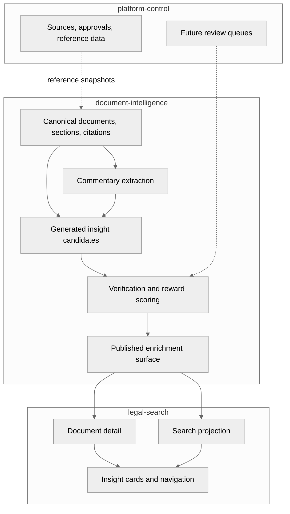

# Commentary Insights Architecture

## Status

Proposed. This document is a planning and research note, not yet an accepted ADR. It should become one or more ADRs once the core decisions are ready to lock, especially the enrichment contract, review workflow, and serving boundary.

## Purpose

Define how Evidara should support useful legal commentary and generated commentary insights without weakening canonical legal truth.

The goal is to make commentary useful for legal research by combining:

- source-grounded legal explanation
- article, section, and case-level navigation
- citation and treatment signals
- structured generated insights
- explicit evidence, confidence, and review state

This document focuses on high-level architecture, product shape, data granularity, and verification planning. It does not introduce a contract change by itself.

## Research Survey

Legal commentary is valuable when it helps researchers understand and navigate primary law. It is not a substitute for the primary authority itself.

### Secondary Sources And Treatises

The Library of Congress describes secondary legal resources as materials that provide analysis, commentary, or restatement of primary law and help locate and explain primary sources: <https://guides.loc.gov/law-secondary-resources>.

Georgetown Law's treatise guidance frames treatises as detailed subject-area sources used to understand doctrine and find relevant primary materials: <https://guides.ll.georgetown.edu/secondary/treatises>.

Implication for Evidara:

- generated commentary should explain and route users to primary law
- it should not become canonical law
- every generated claim needs explicit support

### Headnotes, Digests, And Issue Navigation

Headnotes and digests are useful because they split legal material into researchable legal points. Georgetown describes digests as tools for finding cases on a specific issue or topic: <https://guides.ll.georgetown.edu/cases/headnotes>.

UNLV emphasizes the important boundary that headnotes are not part of the judicial opinion itself: <https://law-unlv.libguides.com/caselaw/headnotes>.

Implication for Evidara:

- the durable unit should be a legal proposition or issue-level insight
- the UI can render those propositions as short cards or paragraphs
- generated text must remain visibly separate from the source document

### Citators And Treatment Signals

Westlaw's KeyCite product describes checking whether a case, statute, regulation, or administrative decision is still good law, and exposing citing references, history, alerts, and warning signals: <https://legal.thomsonreuters.com/en/products/westlaw/keycite>.

LexisNexis Shepard's emphasizes treatment over time, headnote-level treatment, positive and negative signals, and filtered views by issue: <https://www.lexisnexis.com/en-us/products/lexis/shepards.page>.

Implication for Evidara:

- commentary should not only summarize content
- it should expose authority relationships and currentness signals
- treatment should be attached to the relevant proposition when possible, not only to a whole document

### Digital Legal Commentary

Onlinekommentar.ch is a useful reference model for Swiss-style digital commentary. It highlights peer review, versioning, links to external sources, cross-references, full-text search, multilingual access, suggested citation, permalinks, and article-level commenting: <https://onlinekommentar.ch/en/vorteile>.

Implication for Evidara:

- article-level and section-level anchors matter
- versioning and permalink stability are product features, not implementation details
- multilingual presentation should not erase original-language provenance

### Legal AI Reliability

The Stanford evaluation of legal AI research tools found that even RAG-backed legal research systems can hallucinate, reporting hallucination rates of 17% to 33% for evaluated proprietary legal AI tools: <https://arxiv.org/abs/2405.20362>.

The Process Reward Agents paper proposes stepwise evaluation of reasoning paths at inference time instead of relying only on final answers: <https://arxiv.org/abs/2604.09482>.

Implication for Evidara:

- RAG alone is not sufficient as a trust model
- generated insights need step-level verification
- evaluation should happen at the claim and evidence-link level before paragraph rendering

## Definitions

| Term | Meaning |
|---|---|
| Commentary document | A source document whose canonical `document_type` is `commentary`. Examples include article commentaries, practice notes, annotations, or publisher commentary. |
| Generated commentary insight | AI-generated or AI-assisted enrichment derived from canonical documents, sections, citations, relationships, and retrieved evidence. |
| Legal proposition | An atomic statement about a rule, interpretation, condition, exception, treatment, or application. |
| Insight card | A small user-facing grouping of one or more legal propositions, evidence refs, and related authorities. |
| Display paragraph | Human-readable prose generated from structured propositions and support. It is a rendering, not the source of truth. |
| Treatment signal | A validity, currentness, or subsequent-treatment assessment attached to an authority or proposition. |

## Goals

- Preserve canonical document truth in `document-intelligence`.
- Support useful legal research workflows around commentary, not generic long-form AI essays.
- Store generated commentary at a granularity that can be verified, reviewed, translated, updated, and searched.
- Require evidence refs for generated claims.
- Make confidence, review state, model provenance, and generation version explicit.
- Let legal-search render concise insight cards and navigation affordances without owning enrichment truth.
- Keep generated insight contracts separate from canonical `Document`, `Section`, and `Citation` contracts.

## Non-goals

- Making AI-generated commentary canonical law.
- Replacing human-authored legal commentary.
- Generating filing-ready legal advice.
- Hiding uncertainty behind polished prose.
- Introducing a new top-level runtime component before the enrichment boundary is proven.
- Storing only unstructured generated paragraphs with no claim-level support.

## Core Design Principle

Store generated commentary like a citator and headnote system. Render it like commentary.

That means the durable backend unit should be structured, evidence-backed legal propositions. The frontend can group those propositions into readable paragraphs, cards, timelines, and related-authority panels.

## High-Level Architecture



## Layer Responsibilities

| Layer | Owns | Does not own |
|---|---|---|
| `platform-control` | Source governance, approvals, reference data, future human review queue state | Canonical legal document truth, generated insight scoring logic |
| `document-intelligence` | Canonical documents, sections, citations, commentary extraction, generated insight candidates, evidence refs, enrichment scoring | User-facing UI composition, source lifecycle |
| `legal-search` | Search/detail rendering, filters, badges, insight cards, user feedback capture | Canonical or enrichment truth |
| `contracts` | Shared shapes once the enrichment surface is accepted | Experimental internal prompt or model details |

## Proposed Data Model Shape

This is illustrative only. A future PR should formalize it under `contracts/schemas/` if accepted.

```json
{
  "insight_id": "ins_...",
  "target": {
    "document_id": "doc_...",
    "section_id": "sec_...",
    "citation_id": "cit_..."
  },
  "insight_type": "rule_explanation",
  "claim": "A short atomic legal proposition.",
  "display_paragraph": "Readable explanation generated from the supported proposition.",
  "support": [
    {
      "ref_type": "section",
      "document_id": "doc_...",
      "section_id": "sec_...",
      "passage": "Source passage supporting the claim.",
      "confidence": 0.91
    }
  ],
  "related_authorities": [
    {
      "document_id": "doc_...",
      "relationship": "interprets"
    }
  ],
  "jurisdiction_id": "jur_ch_federal",
  "language": "de",
  "original_language": "de",
  "confidence": 0.82,
  "review_state": "machine_generated_unreviewed",
  "generator": {
    "model": "provider/model",
    "prompt_version": "commentary-insight-v1",
    "pipeline_version": "di-..."
  },
  "reward_scores": {
    "source_support": 0.91,
    "citation_validity": 0.96,
    "doctrine_alignment": 0.72,
    "currentness": 0.88
  }
}
```

## Granularity Recommendation

Generated text should be structured down to the legal-proposition level, then rendered at paragraph or card level.

| Layer | Granularity | Purpose |
|---|---|---|
| Evidence reference | document, section, citation, passage | Auditability and source tracing |
| Legal proposition | atomic claim | Verification, scoring, dedupe, treatment, translation |
| Insight card | small group of claims | Review and UI presentation |
| Display paragraph | paragraph | Human readability |
| Long-form generated commentary | optional assembled view | Export, memo, or guided research mode |

Paragraph-level storage alone is too coarse. It makes verification, partial correction, multilingual rendering, and stale-signal updates difficult. Claim-level storage alone is too fragmented for users. The system should keep both: claim-level truth plus paragraph-level rendering.

## Insight Types

The first useful insight taxonomy should stay small.

| Insight type | Description | Example target |
|---|---|---|
| `rule_explanation` | Explains what a provision or case passage does | section |
| `issue_tag` | Identifies the legal issue or doctrine | section or citation |
| `application_condition` | States a condition that triggers a rule | section |
| `exception_or_limit` | Captures a limit, exception, or caveat | section or proposition |
| `authority_link` | Links a provision, decision, commentary, or rechtssatz | citation or document |
| `treatment_signal` | Notes confirming, limiting, distinguishing, or negative treatment | proposition or authority |
| `research_trail` | Suggests the next authorities to inspect | document or section |
| `split_or_tension` | Flags diverging authorities or unresolved questions | issue cluster |

## Verification And Process Reward Agents

The Process Reward Agent pattern should be adapted as a verification stack. Evidara should not trust a final generated paragraph simply because retrieval was used.

Recommended evaluators:

| Evaluator | Checks |
|---|---|
| Source-support evaluator | The claim is supported by quoted or span-linked source text. |
| Citation-validity evaluator | Referenced provisions, cases, and citations exist and normalize to known shapes. |
| Relationship evaluator | The relationship label is plausible, such as `interprets`, `applies`, `cites`, `distinguishes`, or `comments_on`. |
| Jurisdiction-language evaluator | Jurisdiction, authority, language, and translation state are consistent. |
| Currentness evaluator | Later authority or lifecycle data does not obviously undermine the claim. |
| Neutrality evaluator | The display text avoids overclaiming and does not present generated commentary as legal advice. |

Each evaluator should produce structured output:

```json
{
  "evaluator": "source_support",
  "status": "pass",
  "score": 0.91,
  "reason": "The proposition is directly supported by the cited passage.",
  "evidence_refs": []
}
```

## Review State Model

Generated insights need explicit state. A minimal lifecycle:

| State | Meaning |
|---|---|
| `machine_generated_unreviewed` | Generated and scored, not approved by a human. |
| `machine_verified` | Passed automated gates above a configured threshold. |
| `editor_approved` | Reviewed and approved by an authorized reviewer. |
| `rejected` | Should not be served. |
| `stale` | Previously valid but affected by source, lifecycle, or treatment changes. |

`legal-search` should display generated content differently depending on this state.

## Serving Strategy

Search projection should receive only lightweight denormalized fields:

- insight counts
- top issue tags
- reviewed/generated status flags
- related commentary counts
- treatment warning flags

Document detail can fetch richer insight data:

- insight cards grouped by section
- evidence refs and source passages
- related authorities
- reward scores when useful for debugging or trust UI
- review state and generated provenance

The full generated paragraph should not be part of the canonical `Document` schema. It should live in a separate enrichment surface.

## Suggested UI Product Shape

Useful commentary should appear as research tooling:

- "What this section does" card
- "Key conditions" card
- "Exceptions and limits" card
- "Commentary discussing this article" card
- "Cases applying this provision" card
- "Later treatment" card
- "Research trail" card

Each card should allow the user to jump to source passages and related authorities.

## Proposed Phasing

### Phase 0: Research And Contract Sketch

- Keep this architecture note current.
- Confirm the insight taxonomy.
- Draft a JSON Schema for generated commentary insights.
- Identify where enrichment tables would live in `document-intelligence`.
- Define minimal review states.

### Phase 1: Extractive Commentary Anchors

- Reuse the existing commentary extractor path.
- Extract commentary passages and referenced provisions.
- Add deterministic validation:
  - source family is `commentary`
  - passage exists in source text
  - referenced provision is parseable
  - evidence refs resolve
- Add golden tests for a small fixture pack.

### Phase 2: Generated Insight Candidates

- Generate short section-anchored insight candidates.
- Require claim-level evidence refs.
- Store generation metadata and prompt versions.
- Keep generated insights out of canonical document rows.

### Phase 3: Reward Scoring And Review

- Add evaluator outputs for source support, citation validity, jurisdiction-language consistency, and neutrality.
- Gate serving by thresholds and review state.
- Add an operator review workflow if generated insights become user visible.

### Phase 4: Serving And Feedback

- Add lightweight search projection fields.
- Add document-detail insight cards.
- Capture user feedback and quality signals.
- Mark insights stale when source revisions, citations, or treatment signals change.

## Contract Implications

If accepted, this likely needs:

- a new `contracts/schemas/commentary-insight.schema.json`
- examples under `contracts/examples/`
- a DI published enrichment surface
- OpenAPI additions only when legal-search fetches rich insight data synchronously
- search projection additions for lightweight counts and flags
- documentation updates in `docs/components/document-intelligence.md` and `docs/components/legal-search.md`

This should be classified as:

- `architecture-change`
- `pipeline-change`
- `contract-change` once schemas are added
- `user-visible-behavior` once legal-search renders generated insights

## Testing Plan

Use the narrowest tests that prove each layer:

- unit tests for deterministic validators
- schema tests for the insight contract
- golden tests for generated insight candidates on a small curated fixture pack
- invariant tests requiring every generated claim to have evidence refs
- evaluator tests with known supported, unsupported, stale, and ambiguous examples
- BFF/frontend tests only once insight cards are user visible

## Open Decisions

- Should generated insights be persisted first in DI internal tables, published Delta surfaces, or both?
- Which review system owns human approval state: `platform-control`, DI metadata, or a dedicated review integration?
- What is the first jurisdiction and source family for generated insight evaluation?
- Which relationship vocabulary is sufficient for v1?
- Should multilingual display paragraphs be generated separately, translated, or rendered from language-neutral structured propositions?
- What threshold is required for legal-search to display unreviewed machine-generated insights?
- Should stale detection run during reprocessing, indexing, or a separate maintenance job?

## Recommendation

Proceed with an architecture-first PR before implementation.

The first implementation should be extractive and conservative:

1. Keep canonical documents unchanged.
2. Add non-canonical commentary insight candidates.
3. Store claim-level propositions with evidence refs.
4. Render paragraph-level summaries only as derived presentation.
5. Gate any user-visible generated text with verification scores and review state.

This preserves Evidara's contract-first, production-safe posture while opening a path toward genuinely useful legal commentary.
