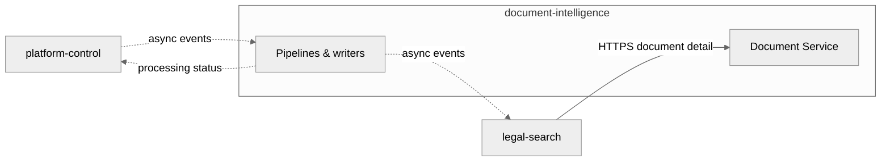

# Communication Model

## Overview

Evidara uses two primary communication patterns:

- synchronous APIs for control and query interactions
- asynchronous events for pipeline progression and operational status

## Synchronous Communication (REST / OpenAPI)

### When to use

- A caller needs an immediate response.
- The interaction is a query or a control-plane command.
- The caller and callee are in a request-response relationship.

### Examples

| Interaction | Caller | Callee | Why sync? |
|-------------|--------|--------|-----------|
| Create a source | User / ops UI | platform-control API | User needs confirmation |
| Approve a source version | User / ops UI | platform-control API | Approval is a control-plane action |
| Get run status | User / ops UI | platform-control API | User needs current state |
| Search documents | User / frontend | legal-search API | User needs results now |
| Get document detail | User / frontend | legal-search API | User needs document content now |

### Conventions

- All sync APIs are defined in `contracts/api/`.
- APIs use JSON over HTTPS.
- IDs and field names use `snake_case`.
- Corpora and tenants are part of control-plane data, not hidden side channels.

## Asynchronous Communication (Events / NATS JetStream)

### When to use

- A producer has completed a stage and downstream work may begin.
- The producer should not block on downstream processing.
- The interaction is long-running or replayable.
- Failure isolation and idempotency matter.

### Examples

| Event | Producer | Consumer(s) | Why async? |
|-------|----------|-------------|-----------|
| `artifact_bundle.available` | platform-control | document-intelligence | Processing starts after immutable acquisition handoff |
| `document.processing_status.updated` | document-intelligence | platform-control | Ops needs visibility without coupling to DI internals |
| `document.processed` | document-intelligence | legal-search | Indexing is downstream of canonical publication |
| `document.withdrawn` | document-intelligence | legal-search | Search removal is separate from canonical publication |
| `index_update.requested` | ops or legal-search | legal-search | Rebuilds and targeted replay should be decoupled |

### Conventions

- All event schemas live in `contracts/events/`.
- All events use the shared envelope in `contracts/common/event-envelope.schema.json`.
- The envelope should remain CloudEvents-aligned so producers and consumers can adopt standard tooling later without rewriting business payloads.
- Event names are versionless; `event_version` carries the contract version.
- Consumers must be idempotent.
- Events carry enough provenance to trace tenant, corpus, source, source version, run, and document lineage.

## Standards And Platform Capabilities

Different layers should solve different problems:

- `contracts/` owns business payloads, typed refs, identities, and lifecycle semantics.
- The broker (**NATS JetStream** in the live self-hosted runtime — [ADR-0029](../adr/0029-self-hosted-hetzner-runtime.md)) is the transport, not the business contract. A Pub/Sub adapter still exists in the code and is retained until cutover is confirmed, but it is not what runs.
- CloudEvents-aligned metadata is the event-envelope standard.
- DI-internal lineage for tables, jobs, and published views comes from the immutable processing manifests plus Delta table history; there is no external catalog service.
- OpenLineage is optional later if Evidara needs lineage that spans processing, control plane, and search operations in one model.
- OpenSearch aliases and versioned indices handle search cutover and rebuild lifecycle inside `legal-search`.

This keeps business contracts small while still allowing strong operational traceability.

## Component Interaction Rules

### Who may call whom

### Strict rules

1. **legal-search does not call DI processing pipelines in the request path.** The BFF may call the **Document Service** (a DI-owned read API) for document detail; that is not a handoff into parsing or canonicalization jobs.
2. **legal-search reads only published DI surfaces referenced by contracts** (via Document Service for interactive reads, and via the same published surfaces for projection indexing).
3. **document-intelligence does NOT manage sources, approvals, or acquisition checkpoints.**
4. **platform-control does NOT parse or canonicalize documents.**
5. **No component reads another component's operational database directly.**

### What interactions MUST be events

| Interaction | Why |
|-------------|-----|
| Immutable bundle available → process it | Long-running pipeline step |
| Processing status update → expose run progress | Ops visibility without table coupling |
| Document canonical-ready → index it | Search projection is downstream of DI |
| Document withdrawn → remove or hide it in search | Search removal is asynchronous and replayable |

### What interactions use APIs

| Interaction | Why |
|-------------|-----|
| CRUD on sources, versions, runs, corpora | Operational workflow needs immediate feedback |
| Search queries | User-facing and latency-sensitive |
| Document detail retrieval (BFF → Document Service) | User-facing and latency-sensitive; keeps Delta access behind a DI-owned read boundary |
