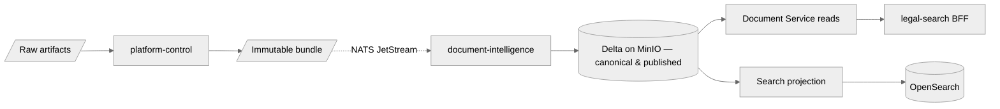

# Data Lifecycle

## Overview

Data moves from **acquisition** through **canonical truth** to **search projections** under explicit contracts. This page summarizes stages and retention intent.

## Stages

| Stage | Owner | Storage | Notes |
|-------|--------|---------|--------|
| Acquisition | platform-control | MinIO (S3) + Postgres metadata | Raw files + manifest refs; immutable handoff. |
| Processing | document-intelligence | Delta (internal + published) | Bronze/silver/gold naming is internal; consumers use **published** surfaces only. |
| Publication | document-intelligence | NATS JetStream + Delta published rows | `document.processed` signals readiness; refs point at contract surfaces. |
| Serving — search | legal-search | OpenSearch | Projections derived from published refs; aliases for cutover. |
| Serving — detail | legal-search BFF + Document Service | OpenSearch (metadata) + Delta (body via API) | Body reads go through `contracts/api/document-intelligence.openapi.yaml` per ADR-0010. |

## Withdrawal & supersession

- **Supersession** — New `document_revision` via `document.processed`.
- **Withdrawal from search** — `document.withdrawn` drives deindexing and UI hiding.

## Retention

- **Legal / compliance** retention for raw and canonical data is a product and policy decision; encode in corpus metadata and MinIO bucket policies.
- **Logs and traces** follow environment retention (e.g. 30–90 days) unless audit requires longer.

## Related

- [Boundary Contracts](boundary-contracts.md)
- [Communication Model](communication-model.md)
- [ADR-0010: Document Content Format](../adr/0010-document-content-format.md)
