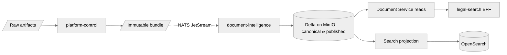

# Data Lifecycle

## Overview

Data moves from **acquisition** through **canonical truth** to **search projections** under explicit contracts. This page summarizes stages and retention intent.

## Stages

| Stage | Owner | Storage | Notes |
|-------|--------|---------|--------|
| Acquisition | platform-control | MinIO (S3) + Postgres metadata | Raw files + manifest refs; immutable handoff. |
| Processing | document-intelligence | Delta (internal + published) | Bronze/silver/gold naming is internal; consumers use **published** surfaces only. |
| Publication | document-intelligence | NATS JetStream + Delta published rows | `document.processed` signals readiness; refs point at contract surfaces. |
| Serving — search | legal-search | OpenSearch | Projections derived from published refs; aliases for cutover. |
| Serving — detail | legal-search BFF + Document Service | OpenSearch (metadata) + Delta (body via API) | Body reads go through `contracts/api/document-intelligence.openapi.yaml` per ADR-0010. |

## Document identity & supersession

- **Identity** — `document_id` is derived from the source plus the document's `upstream_locator`
  (its permalink at the authority: an ELI for Fedlex, the AS landing page for a communal
  ordinance). It is therefore stable across acquisition runs, so re-fetching a law resolves to
  the *same* document. Sources publishing no stable locator fall back to the artifact id, which
  keeps genuinely distinct documents apart at the cost of not collapsing their re-acquisitions.
- **Which URI that is, is a per-provider decision (#850).** It is resolved in exactly one place,
  `acquisition_core/identity.py` (`upstream_locator`), called by `RunService` and
  `FirecrawlWebhookService`. A provider that knows which of its URIs identifies *the law* states
  it by setting `ProviderResource.identity_locator`; that declaration wins over any URL heuristic,
  and providers that declare nothing keep the historical `source_url`-then-`final_url` fallback.
  There is no global rule that could serve every provider: `fedlex_sparql`'s stable URI is its
  `source_url` (the act-level ELI) while its `final_url` embeds the consolidation date, and
  `lexfind_api` is the exact mirror image — its `source_url` is the canton's page, whose path
  embeds the version dates, and `/tol/{id}/{lang}` is the stable one. Getting it backwards for
  either provider mints a fresh `document_id` per version, which is the #652 duplicate mechanism.
  Provenance is a separate question from identity and keeps its own answer: `lexfind_api` still
  records the canton as `source_url`, because a mirrored capture may not cite the mirror.
- **Supersession** — New `document_revision` via `document.processed`. The pipeline reads the
  highest revision already published for that `document_id` and publishes `N+1`, so successive
  acquisitions are ordered rather than all pinned at 1. `_pick_latest_row` orders on
  `(document_revision, processed_at)`, and legal-search drops events whose revision is below the
  latest already projected — a redelivered or replayed older event cannot overwrite newer content.
- **Withdrawal from search** — `document.withdrawn` drives deindexing and UI hiding.

Both halves are load-bearing together: stable identity without moving revisions leaves ordering to
a `processed_at` string comparison, and moving revisions without stable identity just numbers
duplicates (#652).

## Retention

- **Legal / compliance** retention for raw and canonical data is a product and policy decision; encode in corpus metadata and MinIO bucket policies.
- **Enforcement** is the `platform-control-retention-sweep` CronJob (daily, 04:00 UTC): it hard-deletes raw artifacts past their jurisdiction's `CompliancePolicy.retention_days`. See the [retention sweep runbook](../runbooks/retention-sweep.md).
- **Logs and traces** follow environment retention (e.g. 30–90 days) unless audit requires longer.

## Related

- [Boundary Contracts](boundary-contracts.md)
- [Communication Model](communication-model.md)
- [ADR-0010: Document Content Format](../adr/0010-document-content-format.md)
