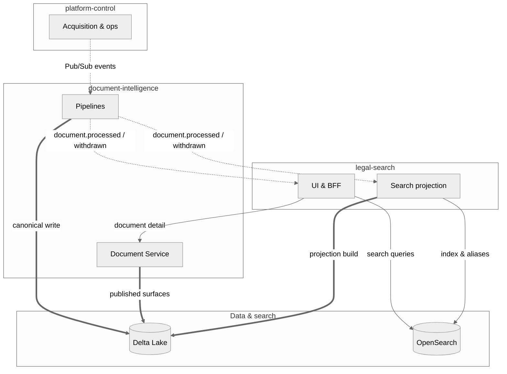

# System Context

## Overview

Evidara is a document intelligence platform organized around three main runtime domains, supported by shared contracts, infrastructure, and documentation.

## Runtime Domains

### platform-control

The operational control plane. Manages the lifecycle of sources, versions, runs, approvals, and reference data. It is the entry point for all new data entering the system.

**Owns:**

- Reference data (jurisdictions, authorities)
- Seed sources and source registry
- Source versions and approvals
- Run records and orchestration
- Internal ops workflows
- Future research workflow control

**Does not own:** canonical document truth, search-serving projections, or user-facing search.

### document-intelligence

The processing engine. Receives raw artifacts and transforms them into canonical structured document intelligence.

**Owns:**

- Raw-to-canonical processing
- Parsing and segmentation
- Jurisdiction assignment
- Citation extraction
- Canonical entities (documents, sections, citations, relationships)
- Databricks pipelines and Delta truth

**Does not own:** source lifecycle, approvals, search index management, or user-facing search.

### legal-search

The user-facing serving layer. Consumes canonical truth and presents it to users through search and document detail experiences.

**Owns:**

- Frontend (Next.js)
- BFF (NestJS)
- OpenSearch serving projections
- Search APIs and document/detail APIs
- User-facing retrieval experience

**Does not own:** canonical document truth, source management, or document processing.

## Supporting Domains

### contracts

The shared language between all components. Defines OpenAPI specs, JSON Schemas, event schemas, shared IDs, and evidence refs. No component may communicate with another except through contracts.

### infra

Provisions and manages runtime environments. Owns Terraform, deployment definitions, GitHub automation, and cloud resource configuration.

### docs

Central documentation including architecture, ADRs, onboarding, runbooks, and component plans.

## Main Interaction Flow

Cross-cutting **contracts** (build-time only): OpenAPI specs, JSON Schemas, event schemas, and shared IDs in `contracts/`.

For container- and component-level views, render [`structurizr/workspace.dsl`](../../structurizr/workspace.dsl) (Structurizr Lite or CLI).

## Feedback Loops

- **legal-search → platform-control:** User feedback, quality signals, and content gap reports can flow back to inform source management and approval workflows.
- **document-intelligence → platform-control:** Processing results, failure reports, and quality metrics feed back into run records and source health tracking.
- **platform-control → document-intelligence:** Approvals and configuration changes trigger re-processing or new runs.

## Deployment Topology

| Component | Primary Runtime | Language | Storage |
|-----------|----------------|----------|---------|
| platform-control | Cloud Run (GCP) | Python / FastAPI | Cloud SQL (Postgres) |
| platform-control (admin) | Cloud Run (GCP) | TypeScript / Next.js + React-admin | — |
| document-intelligence | Databricks | Python | Delta tables, Cloud Storage |
| legal-search (frontend) | Cloud Run (GCP) | TypeScript / Next.js | — |
| legal-search (api) | Cloud Run (GCP) | TypeScript / NestJS | OpenSearch |
| contracts | Build-time only | — | N/A |
| infra | Terraform | HCL | N/A |

### Ops UI

| Tool | Purpose |
|------|---------|
| platform-control (admin) | Internal ops UI for operators — consumes platform-control APIs for both read and action flows |
