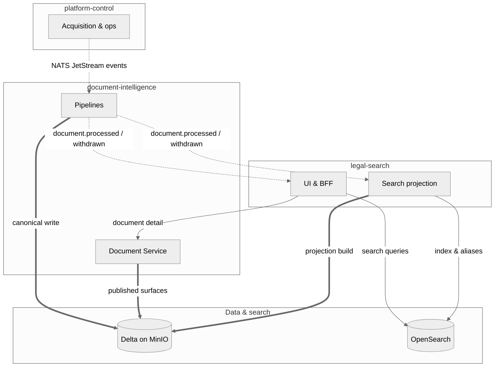

# System Context
> **Platform commands here have moved.** `deploy-stage{1,2,3,8}.sh`,
> `deploy-observability.sh`, `deploy-runners.sh` and the `values/` files now live in
> [research-platform](https://github.com/philipplukas/research-platform) (`scripts/`, `data/`,
> `identity/`, `observability/`). The copies under `infra/hetzner/` are frozen duplicates
> awaiting deletion — see [`infra/hetzner/OWNERSHIP.md`](../../infra/hetzner/OWNERSHIP.md).
> Stages 4 and 5 are still run from this repository.

## Overview

Evidara is a document intelligence platform organized around three main runtime domains, supported by shared contracts, infrastructure, and documentation.

## Runtime Domains

### platform-control

The operational control plane. Manages the lifecycle of sources, versions, runs, approvals, and reference data. It is the entry point for all new data entering the system.

**Owns:**

- Reference data (jurisdictions, authorities)
- Seed sources and source registry
- Source versions and approvals
- Run records and orchestration
- Internal ops workflows
- Future research workflow control

**Does not own:** canonical document truth, search-serving projections, or user-facing search.

### document-intelligence

The processing engine. Receives raw artifacts and transforms them into canonical structured document intelligence.

**Owns:**

- Raw-to-canonical processing
- Parsing and segmentation
- Jurisdiction assignment
- Citation extraction
- Canonical entities (documents, sections, citations, relationships)
- Processing jobs and Delta truth (Delta tables written by the pure-Python `deltalake` sink onto S3-compatible object storage; Spark is opt-in and unused in the live runtime)

**Does not own:** source lifecycle, approvals, search index management, or user-facing search.

### legal-search

The user-facing serving layer. Consumes canonical truth and presents it to users through search and document detail experiences.

**Owns:**

- Frontend (Next.js)
- BFF (NestJS)
- OpenSearch serving projections
- Search APIs and document/detail APIs
- User-facing retrieval experience

**Does not own:** canonical document truth, source management, or document processing.

## Supporting Domains

### contracts

The shared language between all components. Defines OpenAPI specs, JSON Schemas, event schemas, shared IDs, and evidence refs. No component may communicate with another except through contracts.

### infra

Provisions and manages runtime environments. Owns the Hetzner k3s deploy scripts (`infra/hetzner/`), Terraform, deployment definitions, and GitHub automation.

### docs

Central documentation including architecture, ADRs, onboarding, runbooks, and component plans.

## Main Interaction Flow

Cross-cutting **contracts** (build-time only): OpenAPI specs, JSON Schemas, event schemas, and shared IDs in `contracts/`.

Concretely, in the live runtime: `platform-control` publishes to NATS JetStream
(`NatsRawArtifactPublisher`, deduplicated on `Nats-Msg-Id`); `document-intelligence`
consumes with `jobs/nats_consumer.py` and writes canonical Delta to MinIO through
`DeltaCanonicalSink`; and `jobs/projection_bridge_consumer.py` runs always-on as the
NATS → `legal-search` projection bridge.

For container- and component-level views, render [`structurizr/workspace.dsl`](../../structurizr/workspace.dsl) (Structurizr Lite or CLI).

## Feedback Loops

- **legal-search → platform-control:** User feedback, quality signals, and content gap reports can flow back to inform source management and approval workflows.
- **document-intelligence → platform-control:** Processing results, failure reports, and quality metrics feed back into run records and source health tracking.
- **platform-control → document-intelligence:** Approvals and configuration changes trigger re-processing or new runs.

## Deployment Topology

The live runtime is a **self-hosted single-node k3s cluster on a Hetzner dedicated
server** (cluster `evidara-k3s`, namespace `evidara`), per
[ADR-0029: Self-Hosted Hetzner Runtime](../adr/0029-self-hosted-hetzner-runtime.md).
All backing services run in-cluster.

| Component | Primary Runtime | Language | Storage |
|-----------|----------------|----------|---------|
| platform-control | k3s Deployment (Hetzner) | Python / FastAPI | Postgres (CloudNativePG, in-cluster) |
| platform-control (admin) | k3s Deployment (Hetzner) | TypeScript / Next.js + React-admin | — |
| document-intelligence | k3s Deployment (Hetzner) — NATS consumers | Python | Delta tables on MinIO (S3); Nessie + Trino for query |
| legal-search (frontend) | k3s Deployment (Hetzner) | TypeScript / Next.js | — |
| legal-search (api) | k3s Deployment (Hetzner) | TypeScript / NestJS | OpenSearch (in-cluster) |
| contracts | Build-time only | — | N/A |
| infra | k3s deploy scripts + Terraform | Bash / HCL | N/A |

### Cluster services

| Concern | Service |
|---------|---------|
| Events | **NATS JetStream** — `platform-control` publishes (`Nats-Msg-Id` dedup); `document-intelligence` consumes |
| Object storage | **MinIO** (S3-compatible) — raw artifacts, bundle manifests, Delta tables |
| Control-plane database | **CloudNativePG** Postgres |
| Search projections | **OpenSearch** |
| Lakehouse | **Nessie** (Iceberg REST catalog) + **Trino** (query) |
| Ingress | **Traefik** + Let's Encrypt + BasicAuth — `https://admin.evidara.veyo.dev`, `https://search.evidara.veyo.dev` |

### How it is deployed

**Application workloads are GitOps-synced** (ADR-0055): Argo CD watches this repository's
`infra/hetzner/apps` path and reconciles it into the `evidara` namespace, so merging a change
to `apps/kustomization.yaml` is what rolls production, and a cluster that disagrees with
`main` reports `OutOfSync`. Alembic runs as a `PreSync` hook, ahead of the API.

**Everything underneath is still operator-driven**: idempotent staged scripts
(`infra/hetzner/deploy-stage1.sh` … `deploy-stage9.sh`) are run from a laptop with
`kubectl`/`helm` pointed at the cluster. They install the stores, create the imperative
Secrets Argo does not manage, and install Argo CD itself. A cluster still bootstraps by
running them. See [`infra/hetzner/README.md`](../../infra/hetzner/README.md).

The `k8s/gitops/` + Vault scaffolding from ADR-0029 Slice 5 was **deleted** in ADR-0055: it
described a MacConfig-managed platform this deployment never became — wrong namespaces, a
`ClusterSecretStore` that is not installed, placeholder hostnames, an empty `prod/` — and
nothing ever applied it.

### Runtime backends are config-selected

`platform-control` picks its backends by config enum, and the **code defaults are a
standalone local mode**, not a cloud mode:
`artifact_store_backend="local"`, `event_publisher_backend="noop"`,
`run_dispatch_backend="inline"`. Both the GCP and Hetzner runtimes are opt-in via
environment. The live Hetzner deployment selects `s3` + `nats` + `inline`.

### GCP status (dual-state, not removed)

GCP is **wound down, not destroyed**. Be precise about this:

- `infra/terraform/gcp/` still exists in the repo.
- The Cloud Run CD workflow (`platform-control-cd.yml`) still exists but is
  **feature-flagged off** behind `vars.ENABLE_GCP_CLOUD_RUN_CD`.
- The five scheduled nightly workflows that exercised the GCP environment are disabled.
- The Pub/Sub consumer (`document-intelligence/.../jobs/runtime_consumer.py`) is
  **retained** until the Hetzner cutover is confirmed (ADR-0029 Slice 6); the
  Hetzner runtime uses `jobs/nats_consumer.py` instead.

### Ops UI

| Tool | Purpose |
|------|---------|
| platform-control (admin) | Internal ops UI for operators — consumes platform-control APIs for both read and action flows |
