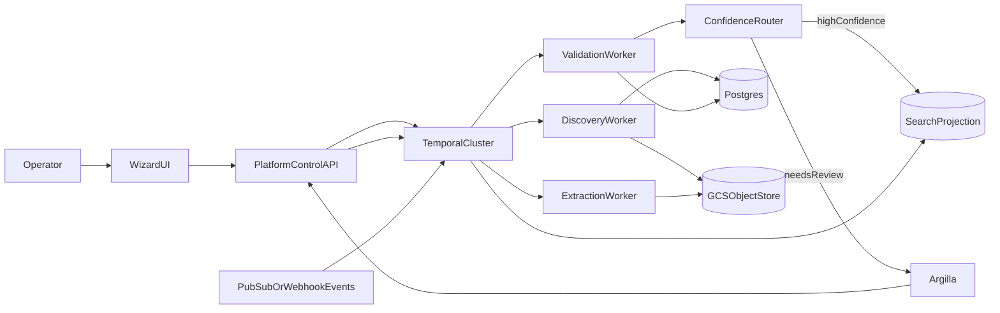

# Temporal + Argilla Wizard Architecture

## Status

Proposed implementation blueprint for platform-control hybrid discovery and extraction operations.

## Purpose

Define a production-safe architecture for a human-guided, AI-assisted wizard that supports hierarchical source discovery, extraction, quality gating, and iterative improvement with durable orchestration.

## Scope

- Covers hybrid execution (`scheduled` + `event-triggered`) for discovery and extraction.
- Uses Temporal for workflow orchestration and checkpointed state.
- Uses custom operator wizard surfaces for setup, approval, and run operations.
- Uses Argilla for review and correction queues.
- Defines initial API, data contracts, routing policy, and SLO/KPI targets.

## Goals

- Keep operators in control of high-impact transitions.
- Allow AI assistance for proposal and first-pass extraction.
- Guarantee resumable runs with auditable state transitions.
- Route uncertainty to human review before publication.
- Produce versioned, provenance-rich outputs for downstream consumers.

## High-Level Architecture

## Temporal Wizard Workflow

The wizard is implemented as a single long-running workflow (`WizardRunWorkflow`) plus child workflows for parallelizable execution shards.

### Workflow states

1. `DraftScope`
2. `DiscoveryPlan`
3. `PilotRun`
4. `HumanGateApproval`
5. `ScaledRun`
6. `ReviewRouting`
7. `FinalizePublish`
8. `MonitorAndDrift`

### Transition contract

| From                | To                  | Trigger                                  | Blocking checks                               |
| ------------------- | ------------------- | ---------------------------------------- | --------------------------------------------- |
| `DraftScope`        | `DiscoveryPlan`     | Operator submits scope draft             | Schema completeness, domain allowlist present |
| `DiscoveryPlan`     | `PilotRun`          | Operator starts pilot                    | Crawl policy valid, seed set non-empty        |
| `PilotRun`          | `HumanGateApproval` | Pilot run completes                      | Minimum sample size reached, no fatal errors  |
| `HumanGateApproval` | `ScaledRun`         | Explicit operator approval               | Pilot quality gates pass                      |
| `HumanGateApproval` | `DiscoveryPlan`     | Operator rejects with notes              | Feedback captured and versioned               |
| `ScaledRun`         | `ReviewRouting`     | Scaled extraction finishes               | Confidence distribution computed              |
| `ReviewRouting`     | `FinalizePublish`   | Review queue drains under target backlog | Required review coverage achieved             |
| `FinalizePublish`   | `MonitorAndDrift`   | Publish succeeds                         | Versioned artifact and index write complete   |
| `MonitorAndDrift`   | `DiscoveryPlan`     | Drift threshold exceeded                 | Drift signal includes affected source set     |

### Temporal-specific design

- Use deterministic workflow code and idempotent activities.
- Store all approval decisions as workflow signals (`approve`, `reject`, `request_changes`).
- Use child workflows for domain shards to reduce blast radius.
- Add `continue_as_new` for long-lived monitor loops.
- Record run history and decision metadata into `RunLedger`.

### Parent-child decomposition (recommended)

Keep operator decisions in a thin parent workflow and push heavy execution into child workflows.

#### Parent workflow: `WizardRunWorkflow`

Owns:

- wizard state transitions (`DraftScope` through `MonitorAndDrift`)
- operator approval/reject decisions
- quality gate evaluation and publish decision
- rollup status for UI/API reporting

Does not own:

- per-country crawling, extraction, and retry loops
- per-authority failure recovery
- per-node confidence scoring details

#### Child workflow: `ScopeShardWorkflow`

A shard is typically `country + jurisdiction + authorityRoot`.

Owns:

- source subtree discovery execution
- extraction task fan-out/fan-in
- shard-local retries/backoff/circuit breaker
- shard-local confidence rollup and conflict counts
- review candidate generation

#### Child workflow: `ReviewDrainWorkflow`

Owns:

- Argilla enqueue batches
- review completion polling/webhook correlation
- stale review escalation
- completion gates for publish readiness

### Event names and transition guards

Use explicit event names so state transitions are inspectable and testable.

| Transition | Event | Guard (must be true) |
|---|---|---|
| `DraftScope -> DiscoveryPlan` | `scope_submitted` | `requiredFieldsPresent && allowedDomainSet` |
| `DiscoveryPlan -> PilotRun` | `pilot_started` | `seedCount > 0 && crawlPolicyValid` |
| `PilotRun -> HumanGateApproval` | `pilot_completed` | `pilotSampleCount >= minPilotSample && fatalErrorCount == 0` |
| `HumanGateApproval -> ScaledRun` | `gate_approved` | `pilotQualityScore >= minPilotQuality` |
| `HumanGateApproval -> DiscoveryPlan` | `gate_rejected` | `rejectionReason != null` |
| `ScaledRun -> ReviewRouting` | `scaled_completed` | `allShardWorkflowsTerminal == true` |
| `ReviewRouting -> FinalizePublish` | `review_backlog_within_target` | `mandatoryReviewOpen == 0 && reviewCoverage >= minCoverage` |
| `FinalizePublish -> MonitorAndDrift` | `publish_succeeded` | `artifactVersionPinned && indexWriteSucceeded` |
| `MonitorAndDrift -> DiscoveryPlan` | `drift_replan_required` | `driftScore >= threshold` |

### Overload detection: when one state does too much

Split a state when one or more conditions appear:

- More than one human decision is needed in the same state.
- More than three retry/error classes are handled in one state.
- p95 state duration is dominated by one shard/family repeatedly.
- Quality signals cannot be attributed to a specific scope shard.
- Operators require multiple screens to make one decision.

When triggered, split by boundary:

- policy decision boundary -> keep in parent workflow
- execution or retry boundary -> move to child workflow
- reviewer throughput boundary -> isolate into review drain child workflow

## Hybrid Execution Modes

### Scheduled mode

- Cron-triggered baseline runs for freshness and broad coverage.
- Daily or hourly cadence per source family.

### Event mode

- Trigger incremental runs from source-change events (sitemap delta, webhook, metadata change).
- Narrow affected scope to impacted source nodes only.

### Reconciliation mode

- Periodic reconciliation merges outputs from scheduled and event runs.
- Deduplicates by canonical source key + content hash + extraction schema version.

## Data Contracts

All contract objects require explicit `contractVersion` and immutable `id`.

### SourceNode

- `id` (uuid)
- `parentId` (nullable uuid)
- `sourceId` (uuid)
- `url` (string)
- `nodeType` (`domain|section|listing|document`)
- `crawlPolicy` (json object: depth, include, exclude, rate limits)
- `effectiveFrom` (timestamp)
- `version` (integer)
- `contractVersion` (string)

### ExtractionSchema

- `id` (uuid)
- `name` (string)
- `version` (semantic version)
- `fields` (array of field definitions)
- `normalizationRules` (json object)
- `requiredFieldSet` (array)
- `contractVersion` (string)

### ExtractionRecord

- `id` (uuid)
- `runId` (uuid)
- `sourceNodeId` (uuid)
- `schemaId` (uuid)
- `schemaVersion` (string)
- `rawArtifactUri` (string)
- `structuredPayload` (json object)
- `fieldConfidence` (json object map by field name)
- `recordConfidence` (float)
- `status` (`accepted|needs_review|rejected`)
- `contractVersion` (string)

### Provenance

- `id` (uuid)
- `recordId` (uuid)
- `sourceUrl` (string)
- `retrievedAt` (timestamp)
- `workerVersion` (string)
- `modelVersion` (nullable string)
- `promptHash` (nullable string)
- `parserSignature` (string)
- `attempt` (integer)
- `contractVersion` (string)

### ReviewTask

- `id` (uuid)
- `runId` (uuid)
- `recordId` (uuid)
- `argillaDatasetId` (string)
- `argillaRecordId` (string)
- `disputedFields` (array)
- `suggestedValues` (json object)
- `reviewDecision` (`accept|edit|reject`)
- `reviewRationale` (string)
- `reviewedBy` (string)
- `reviewedAt` (timestamp)
- `contractVersion` (string)

### RunLedger

- `runId` (uuid)
- `workflowId` (string)
- `stateTransitions` (array with timestamped transitions)
- `retryCounters` (json object by activity type)
- `errorSummary` (json object)
- `slaMarkers` (json object with state enter/exit timings)
- `publishedVersion` (nullable string)
- `contractVersion` (string)

## Confidence Routing and Human Review

### Field-level scoring

- Confidence is computed per field and then aggregated to record confidence.
- Use deterministic guards (regex/schema/range checks) to penalize inconsistent outputs.
- Mark record as conflict when field candidates disagree across extractor strategies.

### Threshold policy (initial defaults)

- `highThreshold = 0.90`
- `lowThreshold = 0.70`

Route behavior:

- `recordConfidence >= highThreshold`: auto-accept and send 5% random audit sample to review.
- `lowThreshold <= recordConfidence < highThreshold`: queue for sampled review (minimum 20%).
- `recordConfidence < lowThreshold` or `conflict=true`: mandatory review in Argilla.

### Argilla payload shape (v1)

Each review task sent to Argilla should contain:

- `external_id`: internal `ReviewTask.id`
- `metadata`: `runId`, `recordId`, `sourceNodeId`, `schemaVersion`, `recordConfidence`
- `fields`: source excerpt, structured candidate payload, disputed fields
- `suggestions`: model/extractor suggestions with confidence
- `guidelines`: task-specific review instructions

### Review ingestion

1. Argilla webhook or polling exports completed annotations.
2. API validates payload signature and schema.
3. `ReviewTask` and `ExtractionRecord` are updated atomically.
4. Corrections are emitted as learning signals for:
  - prompt/rule refinements,
  - extraction heuristics,
  - optional model training sets.

## Minimal API Surface (v1)

### Wizard project and planning

- `POST /wizard/projects`
- `GET /wizard/projects/{projectId}`
- `POST /wizard/projects/{projectId}/scope`
- `POST /wizard/projects/{projectId}/discovery-plan`

### Run lifecycle and approvals

- `POST /wizard/projects/{projectId}/pilot-run`
- `POST /wizard/projects/{projectId}/scaled-run`
- `GET /wizard/runs/{runId}`
- `POST /wizard/runs/{runId}/approve`
- `POST /wizard/runs/{runId}/reject`

### Review synchronization

- `POST /reviews/sync-from-argilla`
- `GET /reviews/tasks/{taskId}`

### Status model (response envelope)

`RunStatus` should expose:

- `runId`, `workflowId`, `state`, `stateEnteredAt`
- `progress`: total nodes, processed nodes, routed to review, accepted records
- `quality`: confidence distribution, conflict count, review backlog
- `health`: retries, last errors, next retry window

## Reliability, Safety, and Rollback

- Idempotent writes for discovery, extraction, and review ingestion activities.
- Retry policy:
  - transient/network: exponential backoff with jitter.
  - deterministic schema errors: no retry, immediate review routing.
- Circuit breaker per source domain when repeated rate-limit or anti-bot failures occur.
- Dead-letter queue for permanently failing records and failed review sync payloads.
- Rollback by `publishedVersion` pointer in `RunLedger`.

## KPIs and SLO Targets (v1)

### Workflow KPIs

- Lead time from `PilotRun` start to `FinalizePublish`.
- Percentage of runs blocked at `HumanGateApproval`.
- Retry rate per 1,000 processed nodes.

### Quality KPIs

- Field-level acceptance rate after review.
- Review edit rate for auto-accepted audit sample.
- Conflict rate (`conflict=true`) by source family.

### Operations KPIs

- Review queue age P50/P95.
- Review throughput per operator/day.
- Drift-triggered rerun volume.

### SLO targets (initial)

- `RunCompletionSLO`: 95% of scheduled runs reach terminal state within 6 hours.
- `ReviewFreshnessSLO`: 90% of mandatory review tasks resolved within 24 hours.
- `PublishQualitySLO`: < 2% critical-field error rate on audited published records.
- `WorkflowAvailabilitySLO`: wizard APIs and workflow control endpoints 99.5% monthly availability.

### Alert thresholds

- `run_stuck_state_minutes > 60`
- `mandatory_review_backlog > 1000`
- `critical_field_error_rate > 0.03` (rolling 24h)
- `drift_break_rate > 0.20` for any source family (rolling 7d)

## Implementation Phasing

### Phase 1: Foundation

- Temporal workflow and state transitions.
- Wizard scope/discovery APIs.
- Discovery and extraction workers.
- Initial confidence scoring and routing skeleton.

### Phase 2: Human loop

- Argilla queue integration.
- Review sync and correction ingestion.
- Operator decision audit trails.

### Phase 3: Quality hardening

- Drift detectors and reconciliation jobs.
- KPI/SLO dashboards and alerts.
- Rollback tooling with published version pinning.

### Phase 4: Scale

- Domain sharding and adaptive concurrency.
- Cost-aware routing and model policy optimization.
- Source-family-specific confidence calibration.

## Conceptual battle-testing suite

Run this suite before implementation freeze and after major workflow updates.

### Scenario matrix

| Scenario | Hierarchy shape | Expected pressure point | Expected mitigation |
|---|---|---|---|
| `single_flat_country` | 1 country, shallow authority tree | Low pressure baseline | Parent workflow remains thin |
| `federal_wide` | Many jurisdictions at same depth | Fan-out and queue surge | Increase shard concurrency limits, isolate slow shards |
| `deep_court_hierarchy` | Country -> jurisdiction -> authority -> chamber -> section -> document | Long-tail traversal latency | Early cutoffs and subtree checkpoints |
| `mixed_source_quality` | One stable authority, one anti-bot, one malformed | Retry taxonomy stress | Domain circuit breakers and deterministic fail routing |
| `policy_variance` | Different include/exclude and language/date policies by jurisdiction | Guard complexity at planning | Policy validation before pilot start |

### Country variation model (CH, AT, DE, FR, IT)

For rollout planning, treat country complexity as a shard-design input, not only as content taxonomy input.

Primary variation dimensions:

- hierarchy depth (number of effective court/authority levels)
- authority breadth (parallel authorities/jurisdictions)
- judicial vs administrative dual-track behavior
- language multiplicity
- metadata quality and taxonomy drift risk

Implementation artifact:

- `platform-control/tests/fixtures/wizard_country_hierarchy_profiles.json`

Validation test:

- `platform-control/tests/unit/test_wizard_country_profiles.py`

Recommended default by complexity class:

- `high`: shard by `country + jurisdiction + authority`
- `medium`: shard by `country + jurisdiction`
- `low`: shard by `country` only

### Metrics to capture per scenario

- state duration per parent state (p50/p95)
- shard completion skew (fastest vs slowest shard)
- retry density by error class
- mandatory review rate and backlog growth
- publish delay attributable to review drain

### Pass/fail heuristics

- No parent state should execute domain-specific retries.
- Parent workflow memory/history growth remains bounded (use `continue_as_new` as needed).
- Review backlog returns below target within SLO window.
- Any single shard failure does not block unrelated shard completion.
- Operator decision points remain limited to explicit gate states.

### Validation harness artifacts

The conceptual state-machine and hierarchy stress suite are codified in test fixtures to keep architecture and implementation aligned:

- `platform-control/tests/fixtures/wizard_state_machine_spec.json`
- `platform-control/tests/fixtures/wizard_battle_test_scenarios.json`
- `platform-control/tests/fixtures/wizard_battle_test_overload_examples.json`
- `platform-control/tests/fixtures/wizard_country_hierarchy_profiles.json`
- `platform-control/tests/fixtures/wizard_calibration_decision_log_example.json`
- `platform-control/tests/unit/test_wizard_state_machine_spec.py`
- `platform-control/tests/unit/test_wizard_state_machine_simulation.py`
- `platform-control/tests/unit/test_wizard_country_profiles.py`
- `platform-control/tests/unit/test_wizard_calibration_contract.py`

Run:

- `uv run pytest platform-control/tests/unit/test_wizard_state_machine_spec.py`
- `uv run pytest platform-control/tests/unit/test_wizard_state_machine_simulation.py`
- `uv run pytest platform-control/tests/unit/test_wizard_country_profiles.py`
- `uv run pytest platform-control/tests/unit/test_wizard_calibration_contract.py`

## Stateful wizard design principles from practice

- Keep parent workflows decision-centric and short-running where possible.
- Model approvals as explicit signals, never implicit side effects.
- Favor typed state snapshots over ad-hoc mutable maps.
- Use idempotency keys for every external write path.
- Keep confidence routing field-aware, not only record-aware.
- Treat review systems as queues with SLOs, not as passive UIs.
- Build for replay and rollback from day one with pinned versions.
- Encode guard conditions as machine-checkable predicates.
- Separate policy validation from execution to avoid mixed concerns.

## Ownership and Source of Truth

- API and workflow contracts: `contracts/api/platform-control.openapi.yaml`
- Event and schema contracts: `contracts/schemas/`
- Operational runbooks: `docs/runbooks/`
- Component behavior narrative: `docs/components/platform-control.md`
- Country calibration worksheet: `docs/runbooks/multi-country-wizard-calibration-worksheet.md`

Argilla is a review surface; internal persisted records remain the final control-plane ledger.