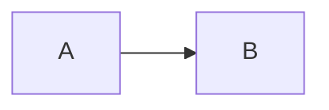
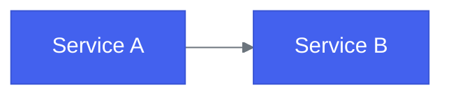
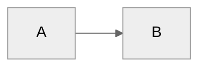
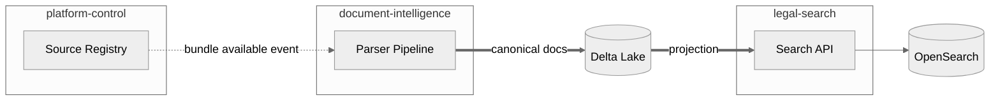
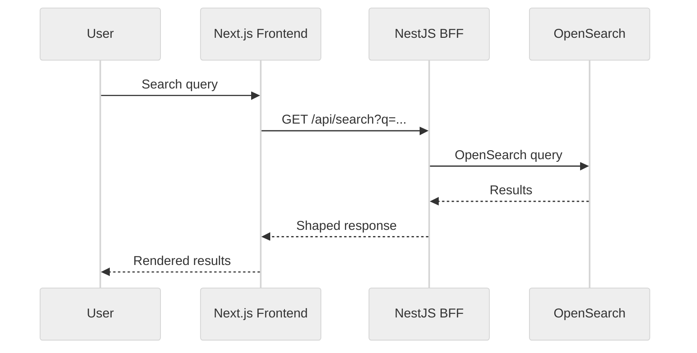
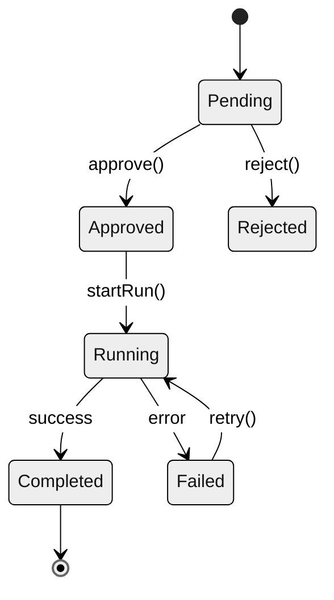
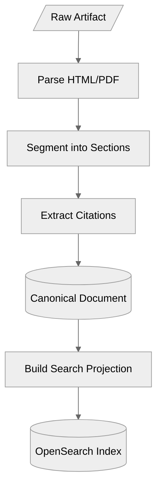
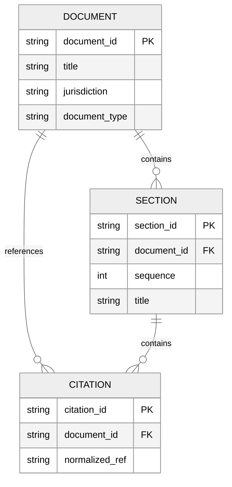

# Mermaid Diagram Style Guide

## When to use diagrams

| Situation | Tool |
|---|---|
| Architecture boundaries, deployments, system relationships | **Structurizr** (`structurizr/workspace.dsl`) |
| Feature flows, sequences, state machines, data flows in docs | **Mermaid** (inline in markdown) |
| Quick one-off sketches in PRs or issues | **Mermaid** (GitHub renders natively) |

**Rule:** Structurizr is the canonical architecture source. Mermaid is for docs-local explanatory diagrams. Do not duplicate Structurizr content as Mermaid.

## Diagram format policy

All diagrams in `docs/` **must** be Mermaid fenced code blocks:

````markdown

````

**Not allowed:**

- ASCII art diagrams (hard to read, not searchable, not rendered)
- PlantUML (requires external rendering, not supported by GitHub or mkdocs natively)
- External image files for diagrams (cannot be diffed, go stale silently)
- Excalidraw/draw.io exports as images (same problem — not version-controlled as code)

**Note:** `docs/architecture/system-context.md` uses Mermaid for the high-level flow; detailed C4 views remain in Structurizr (`structurizr/workspace.dsl`).

## Mermaid theme

Use the `%%{init}%%` directive at the top of every diagram to set a consistent theme:

````markdown

````

Or for simpler diagrams where the defaults work well, use the `neutral` theme:

````markdown

````

## Standard node shapes

Use consistent shapes across all diagrams:

| Concept | Shape | Mermaid syntax |
|---|---|---|
| Service / application | Rounded rectangle | `A[Service Name]` |
| Database / store | Cylinder | `A[(Database)]` |
| External system | Hexagon | `A{{External System}}` |
| User / person | Stadium | `A([User])` |
| Decision / condition | Diamond | `A{Decision?}` |
| Event / message | Parallelogram | `A[/Event Name/]` |
| Process / step | Rectangle | `A[Step Name]` |

## Arrow styles

| Meaning | Syntax | Example |
|---|---|---|
| Synchronous call | `-->` | `A --> B` |
| Asynchronous / event | `-.->` | `A -.-> B` |
| Data flow | `==>` | `A ==> B` |
| With label | `-->\|label\|` | `A -->\|HTTPS\| B` |

## Standard diagram templates

### Container overview

Use for showing how components interact:

````markdown

````

### Sequence diagram

Use for request/response flows:

````markdown

````

### State diagram

Use for lifecycle and workflow states:

````markdown

````

### Data flow

Use for pipeline and transformation flows:

````markdown

````

### Entity relationship

Use for data model documentation:

````markdown

````

## Naming conventions

- **Node IDs:** Short uppercase abbreviations (`PC`, `DI`, `LS`, `OS`)
- **Labels:** Full human-readable names in brackets (`[Source Registry]`)
- **Subgraph titles:** Component names in quotes (`"platform-control"`)
- **Arrow labels:** Protocol or verb (`|HTTPS|`, `|event|`, `|reads|`)

## Size guidelines

- Keep diagrams **under 15 nodes.** If larger, split into multiple diagrams.
- One diagram per concept. Don't try to show everything in one picture.
- Prefer `LR` (left-right) for flow diagrams, `TD` (top-down) for hierarchies.

## Review checklist for diagrams

When reviewing a PR with diagrams, check:

- [ ] Is it Mermaid (not ASCII, PlantUML, or an image)?
- [ ] Does it use the standard theme directive?
- [ ] Are node shapes consistent with the table above?
- [ ] Is it under 15 nodes?
- [ ] Does it duplicate Structurizr content? (If so, it should reference Structurizr instead)
- [ ] Does it render correctly in the GitHub markdown preview?
