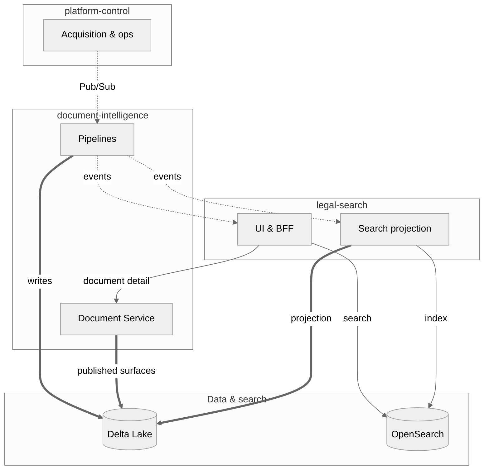

# Evidara

Welcome to the Evidara documentation — the knowledge hub for the document intelligence platform.

## What is Evidara?

Evidara is a document intelligence platform for legal research. It ingests raw legal documents, processes them into structured canonical data, and serves them through a search and exploration experience.

## Platform Architecture

Cross-cutting **contracts** (build-time): OpenAPI, JSON Schemas, and events in `contracts/`. Detailed C4 views: `structurizr/workspace.dsl`.

## Quick links

| Area                                                                                             | Description                                                                      |
| ------------------------------------------------------------------------------------------------ | -------------------------------------------------------------------------------- |
| [Architecture](architecture/system-context.md)                                                   | System context, storage, communication                                           |
| [Commentary insights architecture](architecture/commentary-insights-architecture.md)              | Research-backed plan for generated commentary insights, evidence, and review     |
| [Temporal + Argilla Wizard](architecture/temporal-argilla-wizard-architecture.md)                | Wizard design record. Argilla removed, Temporal not deployed — see ADR-0031      |
| [Wizard / Temporal / Argilla rollout](setup/platform-control-wizard-temporal-argilla-rollout.md) | Not a live procedure — superseded by ADR-0031                                    |
| [Multi-country operator playbook](runbooks/platform-control-multi-country-operator-playbook.md)  | CH/AT/DE/FR/IT onboarding, approval, triage                                      |
| [Extraction review routing](runbooks/extraction-review-routing.md)                               | Confidence-band routing to the operator review queue, and the decision loop      |
| [ADRs](adr/0001-monorepo-structure.md)                                                           | Architecture decisions                                                           |
| [Components](components/legal-search.md)                                                         | Domain component documentation                                                   |
| [Testing](testing/README.md)                                                                     | Testing strategy and guides                                                      |
| [Setup / environment strategy](setup/environment-strategy.md)                                   | Dev, optional staging, prod; **dev-first** operator posture when staging GCP is absent |
| [Evidara CLI (API smoke)](https://github.com/philipplukas/evidara/blob/main/tools/evidara-cli/README.md) | `evidara` pings, OpenAPI discovery, env vars per environment |
| [Phase 5 go / no-go memo](runbooks/phase-5-go-no-go-memo.md)                                     | Release gates, Linear evidence (TAR-64 / 77 / 85), M5 checklist |
| [Milestone planning rubric](runbooks/milestone-planning-rubric.md)                               | Product + engineering lens for milestone updates, Linear comments, and stakeholder status |
| [UI review checklist](runbooks/ui-review-checklist.md)                                            | Screenshot/video/manual review loop for demo readiness, aesthetics, and trust feedback |
| [Phase 5 evidence checklist](runbooks/phase-5-evidence-checklist.md)                         | Single-page TAR-64 / TAR-77 / TAR-85 entry for TAR-69 |
| [Linear M5 / Phase 5 handoff pack](runbooks/linear-milestone5-handoff-pack.md)               | Copy-paste issue bodies, child-issue map, agent prompts (Linear UI) |
| [TAR-89 workstreams](runbooks/tar-89-workstreams.md)                                           | Child-issue split: data / serving / staging metadata credibility |
| [Internal beta user-flow evidence](runbooks/internal-beta-user-flow-evidence.md)                | Hetzner staging packet for seeded search/detail, HITL rescore, and recovery evidence |
| [Post-MVP engineering workstreams](runbooks/post-mvp-engineering-workstreams.md)               | TAR-66 → TAR-62 → TAR-63 → TAR-67 after TAR-64 green |
| [Postgres backup and restore](runbooks/postgres-backup-and-restore.md)                        | CNPG barman/PITR config, health checks, the quarterly restore drill |
| [Zitadel identity provider](runbooks/zitadel-identity-provider.md)                            | ADR-0038 step 2: deploy checklist, restore drill gate, break-glass |
| [Hetzner runner secret capture](runbooks/hetzner-runner-secret-capture.md)                    | Preserve-before-wipe checklist for the old Hetzner runner host secrets |
| [Hetzner runner secret capture checklist](runbooks/hetzner-runner-secret-capture-checklist.md) | Step-by-step archive and classification checklist for the legacy runner host |
| [MacConfig GitOps migration](migration/README.md)                                             | Platform vs product inventory, Argo cutover, slimming plan, contract changelog |
| [ARC runner migration matrix](migration/arc-runner-migration-matrix.md)                       | Which workflows move to ARC light, ARC heavy, stay off-cluster, or stay GitHub-hosted |
| [Migration parallel workstreams](migration/parallel-workstreams.md)                           | Lanes A–G: what runs in parallel vs serialized seams |
| [CI Actions duration metrics](runbooks/ci-actions-duration-metrics.md)                         | `analyze_github_actions_queue.py`, runner pool policy |
| [API Reference](api/legal-search.md)                                                             | OpenAPI interactive docs (legal-search, document-intelligence, platform-control) |

## Repository structure

See [Repository Structure](architecture/repository-structure.md) for the full layout.

## Contributing

See [CONTRIBUTING.md](https://github.com/philipplukas/evidara/blob/main/CONTRIBUTING.md) for branch naming, PR expectations, and merge strategy.
