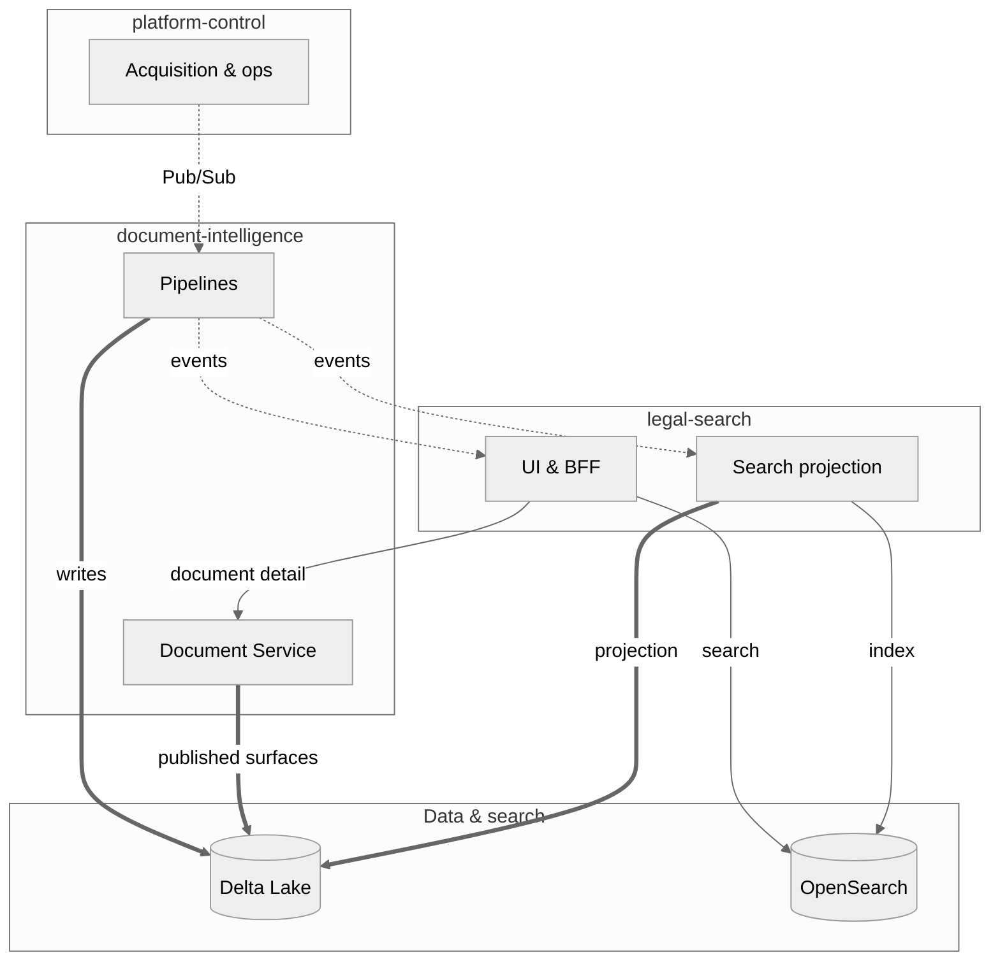

# Evidara

Welcome to the Evidara documentation — the knowledge hub for the document intelligence platform.

## What is Evidara?

Evidara is a document intelligence platform for legal research. It ingests raw legal documents, processes them into structured canonical data, and serves them through a search and exploration experience.

## Platform Architecture

Cross-cutting **contracts** (build-time): OpenAPI, JSON Schemas, and events in `contracts/`. Detailed C4 views: `structurizr/workspace.dsl`.

## Quick links

| Area | Description |
|---|---|
| [Architecture](architecture/system-context.md) | System context, storage, communication |
| [ADRs](adr/0001-monorepo-structure.md) | Architecture decisions |
| [Components](components/legal-search.md) | Domain component documentation |
| [Testing](testing/README.md) | Testing strategy and guides |
| [Setup](setup/environment-strategy.md) | Development and deployment setup |
| [API Reference](api/legal-search.md) | OpenAPI interactive docs (legal-search, document-intelligence, platform-control) |

## Repository structure

See [Repository Structure](architecture/repository-structure.md) for the full layout.

## Contributing

See [CONTRIBUTING.md](https://github.com/philipplukas/evidara/blob/main/CONTRIBUTING.md) for branch naming, PR expectations, and merge strategy.
