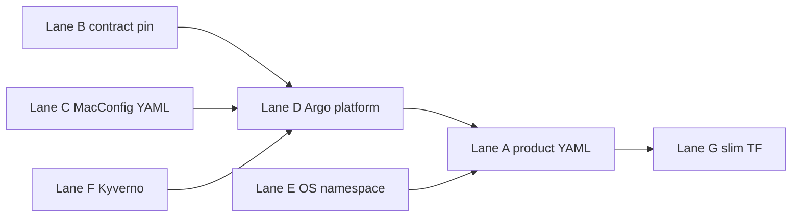

# Parallel workstreams (MacConfig GitOps migration)

Use this page to **run several migration tracks at once** without duplicating ownership or blocking
unrelated work. It extends the general monorepo rules in
[Parallel work streams (by component)](../process/parallel-work-streams.md).

## Stream map (what can run in parallel)

| Lane | Where | Typical owner | In-repo status | Needs outside repo |
| --- | --- | --- | --- | --- |
| **A — Product GitOps tree** | [`k8s/gitops/`](../../k8s/gitops/) (`dev/`, `staging/`, `prod/`) | Infra + service teams | Kustomize roots exist; add manifests per slice | Argo `Application` + cluster |
| **B — Contract + inventory** | [`vendor/`](../../vendor/), [`platform-product-inventory.md`](platform-product-inventory.md) | Platform | Vendor + CI + inventory tables | MacConfig `main` when bumping contract |
| **C — MacConfig platform** | [MacConfig](https://github.com/philipplukas/MacConfig) `clusters/<env>/` | Platform / MacConfig | Not this repo | PRs + `make platform-k8s-check` there |
| **D — Argo cutover (non-prod first)** | [`examples/`](examples/), cluster | Platform / SRE | Example YAML + checklists | `kubectl` / Argo UI, `AppProject` |
| **E — OpenSearch namespace align** | [`infra/env/*/opensearch.gke.tfvars.example`](../../infra/env/), Terraform `gke_stack` | Infra | Examples + variable validation | `terraform apply` per environment |
| **F — Admission / Kyverno** | MacConfig `clusters/*/platform/kyverno/` | Platform | Evidara: [cluster enforcement plan](cluster-enforcement-plan.md) only | MacConfig PRs, schema/CI alignment |
| **G — Slim Evidara Terraform** | `infra/terraform/opensearch/gke_stack` (later more) | Infra | [Slim plan](slim-evidara-plan.md) | **After** Lane A + D own the same objects |

## Serialize (do not parallelize the same object)

- **Same Kubernetes `kind` + `namespace` + `name`** — only one of: MacConfig platform app, Evidara
  product app, or Terraform-managed resource.
- **OpenSearch namespace rename** — coordinate Lane **E** with Lane **A** (Helm release target
  namespace) and any running workloads; not parallel with blind TF + GitOps edits on the same cluster.
- **Lane G after cutover** — do not remove Terraform `helm_release` until Lane **D** shows Argo
  syncing the replacement (or an explicit rollback path).

## Suggested parallel starters (this week)

These can proceed **at the same time** on different branches or by different owners:

1. **Lane A** — Add the first real product manifest in **`k8s/gitops/staging/`** (smallest slice, for
   example a `ConfigMap` or a single `Deployment` behind a feature flag), not prod.
2. **Lane D** — Apply **platform** `Application` for MacConfig in a **non-prod** cluster only; leave
   prod for after staging proof.
3. **Lane C** — Open a MacConfig PR for any missing **staging** parity with prod (namespaces, netpol,
   RBAC) if your staging cluster should mirror prod policy.
4. **Lane E** — Pick `opensearch_namespace` for each live environment; document the choice in the
   inventory “What moved” table.
5. **Lane F** — Draft `ClusterPolicy` in a MacConfig branch; do **not** wire into root `kustomization.yaml`
   until kubeconform/CI is green (per MacConfig’s Kyverno README).

## Dependency sketch

## Related

- [Migration overview](README.md)
- [Argo cutover checklist](argo-cutover-checklist.md)
- [Max parallel execution](../process/max-parallel-execution.md)
