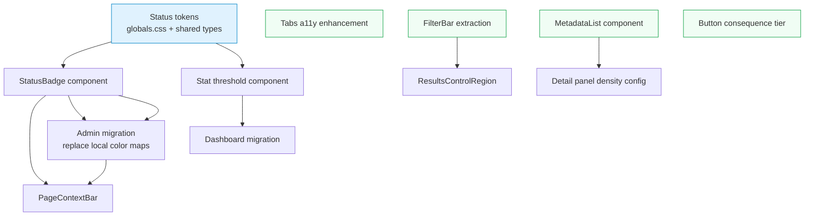

# Design-system contracts — parallel execution plan

**Implements:** [ADR-0016](../adr/adr-0016-design-system-component-contracts.md)  
**Follows:** [Parallel work streams](parallel-work-streams.md), [Max parallel execution](max-parallel-execution.md)

## Dependency graph



Blue = shared foundation (must land first).  
Green = independent roots (can start immediately, no dependencies on each other).

## Seven parallel streams

The 8 contracts decompose into 6 component-contract streams plus one visual-quality stream. Streams A–E and G can all start simultaneously when they do not touch the same files. Stream F starts after A's foundation PR lands.

### Stream A: Status system (shared foundation)

**Surface:** Both (tokens in legal-search; component used by admin + legal-search)  
**Serialization gate:** `globals.css` and shared type file

| Step | Task | Files | Depends on |
|---|---|---|---|
| A1 | Define status tokens (`--status-healthy`, `--status-degraded`, `--status-critical`, `--status-neutral`, `--status-info`) and `StatusLevel` type | `globals.css`, new `src/lib/status-tokens.ts` | — |
| A2 | Build `StatusBadge` component (color + icon + label from `status` prop) | new `src/components/primitives/StatusBadge.tsx` | A1 |
| A3 | Build `Stat` threshold component (auto-applies `StatusLevel` from value + threshold) | new `src/components/primitives/Stat.tsx` | A1 |
| A4 | Migrate admin `Dashboard.tsx` — replace `TONE_ACCENTS`, `STATUS_COLORS`, `HEALTH_COLORS` with `StatusBadge` | `Dashboard.tsx` | A2, A3 |
| A5 | Migrate admin run/source status chips — `RunShow.tsx`, `RunList.tsx`, `SourceList.tsx`, `SourceShow.tsx` | Multiple admin files | A2 |
| A6 | Build `PageContextBar` (sticky summary with title + status) | new admin component | A2 |
| A7 | Add `PageContextBar` to `RunShow.tsx` and `SourceShow.tsx` | Admin resource files | A6 |

**PR sequence:** A1 → (A2 + A3 parallel) → (A4 + A5 + A6 parallel) → A7

---

### Stream B: Tabs accessibility

**Surface:** Legal-search only  
**Serialization gate:** None (isolated files)

| Step | Task | Files | Depends on |
|---|---|---|---|
| B1 | Migrate `DetailTabs.tsx` to use Radix `Tabs` primitives from `ui/tabs.tsx` with `line` variant | `DetailTabs.tsx` | — |
| B2 | Wire `aria-selected="true"` (comes from Radix for free) and ensure 2-dimension active state (weight + indicator) | `DetailTabs.tsx`, `ui/tabs.tsx` if needed | B1 |
| B3 | Update `useActiveTab()` to read from Radix context instead of standalone `nuqs` | `DetailTabs.tsx` | B1 |
| B4 | Update e2e screenshot-pack test (tab selectors may change from `button` to Radix tab triggers) | `screenshot-pack.spec.ts` | B2 |

**PR sequence:** Single PR (B1–B4 are small enough to ship together)

---

### Stream C: Filter system

**Surface:** Legal-search only  
**Serialization gate:** `ContextBar.tsx`, `globals.css` (overlaps with Stream A on `globals.css` — coordinate)

| Step | Task | Files | Depends on |
|---|---|---|---|
| C1 | Extract `FilterBar` component from `FilterPanel` + `ContextBar` — owns chip rendering, active count, per-chip dismiss, clear-all | new `src/components/filters/FilterBar.tsx` | — |
| C2 | Refactor `ContextBar` to compose `FilterBar` inside a single region | `ContextBar.tsx` | C1 |
| C3 | Refactor `FilterPanel` to delegate chip/clear logic to `FilterBar` | `FilterPanel.tsx` | C1 |
| C4 | Refactor `FiltersSheet` (mobile) to use same `FilterBar` | `FiltersSheet.tsx` | C1 |
| C5 | Define `ResultsControlRegion` wrapper — IA rule documented, layout component created | `legal-search/frontend/src/components/results/ResultsControlRegion.tsx`, `WorkspaceClient.tsx`, `MobileWorkspace.tsx` | C2 |

**PR sequence:** C1 → (C2 + C3 + C4 parallel) → C5

---

### Stream D: Content density

**Surface:** Legal-search only  
**Serialization gate:** None (isolated files)

| Step | Task | Files | Depends on |
|---|---|---|---|
| D1 | Define `MetadataField` type with `visibility` (`always` / `default` / `expanded`) | new or extend `src/lib/types.ts` | — |
| D2 | Build `MetadataList` component with `density` prop | new `src/components/detail/MetadataList.tsx` | D1 |
| D3 | Define field visibility config per document type (law, decision, commentary, rechtssatz) | new `src/lib/metadata-visibility.ts` | D1 |
| D4 | **Done:** `MetadataList` wired in `DetailsTab.tsx` (replaces removed `MetadataSection`) | `DetailsTab.tsx`, `MetadataList.tsx` | D2, D3 |
| D5 | Migrate `DetailPanelHeader.tsx` to show compact metadata by default, expanded on interaction | `DetailPanelHeader.tsx` | D2 |

**PR sequence:** D1 → (D2 + D3 parallel) → (D4 + D5 parallel)

---

### Stream E: Action safety

**Surface:** Both (component in legal-search `ui/`; consumed by admin)  
**Serialization gate:** `ui/button.tsx`

| Step | Task | Files | Depends on |
|---|---|---|---|
| E1 | Add `tier` prop to `Button` (`safe` / `notable` / `destructive`) with inline confirm popover and modal confirm | `ui/button.tsx`, new `ui/confirm-popover.tsx` | — |
| E2 | Classify existing admin actions by tier (audit `RunLaunchDialog`, `RunActions`, `SourceVersionsSection`) | Documentation / code comments | — |
| E3 | Apply `tier="notable"` to Production Run launch button, `tier="safe"` to Preview Run | `RunLaunchDialog.tsx` | E1 |
| E4 | Apply `tier="destructive"` to Cancel Run, Reject Version | `RunActions.tsx`, `SourceVersionsSection.tsx` | E1 |
| E5 | Add physical separation between Preview Run / Production Run actions in version table | `SourceVersionsSection.tsx` | E3 |

**PR sequence:** (E1 + E2 parallel) → (E3 + E4 + E5 parallel)

---

### Stream F: Admin dashboard health

**Surface:** Admin only  
**Serialization gate:** `Dashboard.tsx` (shared with Stream A step A4 — **must serialize**)

| Step | Task | Files | Depends on |
|---|---|---|---|
| F1 | Add overall health indicator to dashboard header (aggregate from recent health) | `Dashboard.tsx` | Stream A (A2 for `StatusBadge`) |
| F2 | Apply threshold to Success Rate stat (warn at 95%, critical at 80%) | `Dashboard.tsx` | Stream A (A3 for `Stat`) |
| F3 | Add section-level health indicators to "Runs by Status" and "Recent health snapshot" panels | `Dashboard.tsx` | A2 |

**PR sequence:** Starts after Stream A lands A2 + A3. Then F1 → (F2 + F3 parallel).

---

### Stream G: UI/UX aesthetics, styling, and brand consistency

**Surface:** Both, with PRs split by surface where possible
**Serialization gate:** Shared token/style files and screenshot baselines

Owns visual polish and cross-surface brand consistency for `legal-search/frontend` and `platform-control/admin` without changing API contracts, business behavior, or data semantics. The stream may adjust design tokens, component styling, responsive layout, screenshot evidence, and copy-level presentation where needed for credibility, hierarchy, accessibility, and demo readiness.

| Step | Task | Files | Depends on |
|---|---|---|---|
| G1 | Run a visual audit pass and update the TAR-243 findings log | `docs/runbooks/ux-aesthetic-review.md`, screenshot pack evidence | — |
| G2 | Legal-search polish: header hierarchy, result scope, detail tabs, filters, loading parity | `legal-search/frontend/src/**`, `legal-search/frontend/docs/**` as needed | G1; serialize with B/C on shared files |
| G3 | Admin brand consistency: same Evidara brand language as legal-search, with operator-first density; readiness/status presentation, source/version actions, v2 shell parity | `platform-control/admin/src/**`, admin docs as needed | G1; serialize with E/F on shared files |
| G4 | Visual regression follow-up: update or extend screenshot baselines deliberately | `legal-search/frontend/e2e/**`, screenshot baselines, testing docs | G2/G3 as applicable |

**Suggested PR split:** `design/tar-243-visual-audit-pass`, `style/tar-243-legal-search-polish`, `style/tar-243-admin-brand-consistency`, `test/tar-243-visual-regression-followup`.

**G3 same-brand rule:** Admin should feel like the control plane of the same Evidara product, not a clone of the legal-search workspace. Keep the shared semantics identical: navy is identity/environment chrome, violet is action and active state, status colors mean the same thing, focus rings match, and pill/status/elevation tokens come from the shared system. Keep the admin intentionally different where it serves operators: denser tables, faster scanning, task-first page headers, and less document-reading/editorial whitespace.

---

## Parallelism map (what can run at the same time)

```
Week 1:  A1 ──→ A2+A3    B1-B4 (single PR)    C1    D1 ──→ D2+D3    E1+E2    G1
Week 2:  A4+A5+A6         (done)                C2-C4 D4+D5           E3+E4+E5 G2+G3
Week 3:  A7               —                     C5    —               —        G4
Week 3:  F1+F2+F3 (after A lands)
```

**Max concurrency at any point:** 6 streams (A + B + C + D + E + G), collapsing as isolated streams complete.

## Serialization gates (where streams must NOT overlap)

| Gate | Streams | Rule |
|---|---|---|
| `globals.css` | A + C | A1 (status tokens) lands first; C coordinates on rebase |
| `legal-search/frontend/src/app/globals.css` | B + C + G | One owner for legal-search shell/token styling at a time |
| `platform-control/admin/src/app/globals.css` | E + F + G | One owner for admin shell/token styling at a time |
| `Dashboard.tsx` | A + F | A4 lands first; F starts after |
| `ui/button.tsx` | E only | No other stream touches this file |
| `ContextBar.tsx` | C only | Already changed by ad-hoc fix; C formalizes |
| `DetailTabs.tsx` | B only | Isolated migration |
| Screenshot baselines | G + any visual PR | Baseline update PRs serialize so diffs stay reviewable |

## What each stream delivers independently

| Stream | Standalone value (even if others are delayed) |
|---|---|
| A | Every status chip in admin becomes icon + color + label; WCAG 1.4.1 fixed for badges |
| B | Detail tabs have visible active state + correct ARIA; WCAG compliance |
| C | Filters live in one zone; clear-all works on desktop and mobile; IA rule documented |
| D | Detail panel shows more metadata by default; density is configurable per document type |
| E | Production Run requires confirmation; Preview/Production visually distinguished |
| F | Dashboard health turns red/amber automatically; operators read status, not numbers |
| G | Visual credibility, brand coherence, and demo-readiness issues are triaged into surface-scoped PRs with screenshot evidence |

## Related

- [ADR-0016: Design-system component contracts](../adr/adr-0016-design-system-component-contracts.md)
- [Parallel work streams (by component)](parallel-work-streams.md)
- [Max parallel execution](max-parallel-execution.md)
- [UX / Aesthetic review runbook](../runbooks/ux-aesthetic-review.md)
