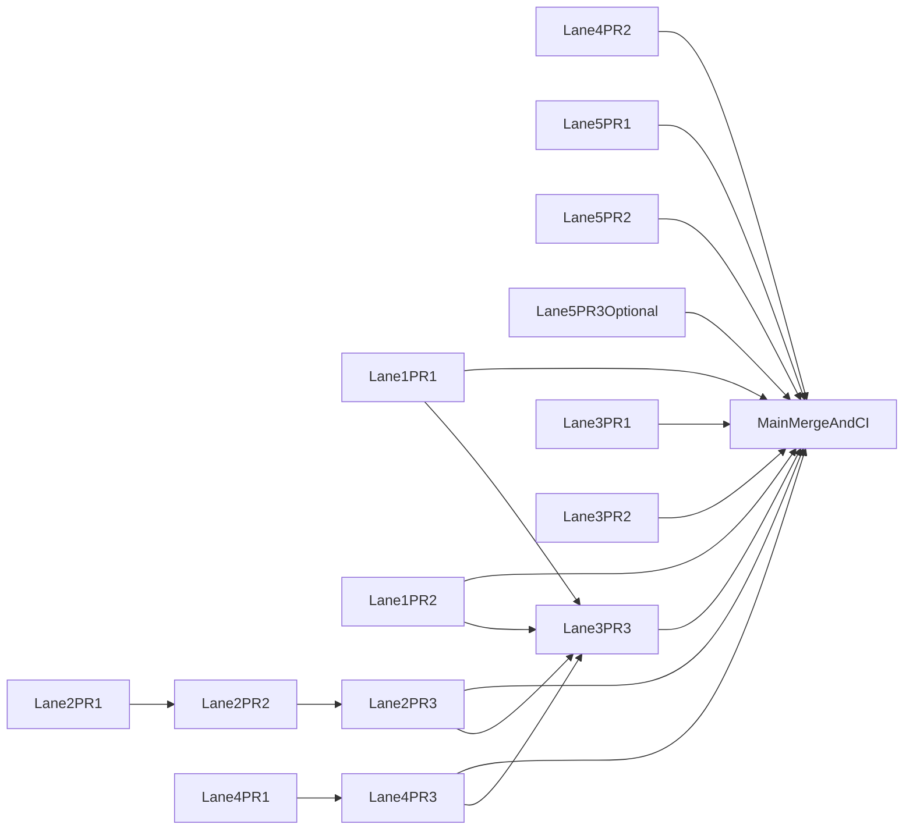

# Evidara Active Parallel PR Stacks

Use this when executing the current open `Evidara` backlog in parallel. This document turns the high-level lane plan into concrete worktrees, branch names, PR titles, and merge ordering.

It is intentionally narrower than:

- [`parallel-work-streams.md`](parallel-work-streams.md), which defines the stable component seams
- [`max-parallel-execution.md`](max-parallel-execution.md), which defines general concurrency and serialization policy
- [`../setup/branch-rules.md`](../setup/branch-rules.md), which defines branch and worktree conventions

## Scope

This execution guide covers the currently open items that still benefit from a parallel split:

- `TAR-62` - P5 WS2: DI + infra promotion automation
- `TAR-63` - P5 WS5: replay/checkpoint orchestration in `platform-control`
- `TAR-67` - P5 WS6: operational drills and runbook verification
- `TAR-69` - P5 WS8: go/no-go release recommendation and operator demo wrap-up
- `TAR-85` - P7-3: repeatable MVP acceptance scenario pack
- `TAR-139` - P7-6: agent-ready workflow surface for `platform-control` + `legal-search`

## Execution status (rolling)

As of **2026-04-11**, the **repo-side** splits below are largely landed on `main` (use git history for the exact PR numbers):

- **Lane 1 (`TAR-62`):** staging bundle promotion, runtime promotion gating, and promotion runbook/docs (`#187`, `#188`, `#189`).
- **Lane 2 (`TAR-63`) + Lane 4 (`TAR-85`) + Lane 5 (`TAR-139`) (combined delivery):** replay checkpoint metadata, MVP acceptance / CLI workflow hardening, read-only OpenAPI discovery helpers, and related surfaces (`#190`). Follow the file-level ownership table above when making new edits so two branches do not fight the same seam.
- **Lane 3 (`TAR-67` + `TAR-69`):** drill runbook alignment, readiness / staging evidence workflows, and phase-5 memo + MVP demo recommendation package (`#191`, `#192`, `#193`).

**Still outside git (operator / Linear):** fresh evidence for **TAR-64** (dev smokes), **TAR-77** (branch protection + release readiness), **TAR-85** (staging MVP acceptance), and **executed** **TAR-67** drills with workflow URLs and downloaded artifacts — see [phase-5 go / no-go memo](../runbooks/phase-5-go-no-go-memo.md) section 5 and [MVP demo release recommendation](../runbooks/mvp-demo-release-recommendation.md).

**Optional later:** Lane **5 PR 3** (contract-backed agent workflow operations) only if discovery proves new APIs are required; treat as contract-first and serialize on OpenAPI files per [max-parallel-execution](max-parallel-execution.md).

## Shared Rules

1. Create one dedicated worktree per lane on a `shelf/*` branch. Do not open a PR from the `shelf/*` branch itself.
2. Create PR branches inside that worktree using the prefixes from [`../setup/branch-rules.md`](../setup/branch-rules.md).
3. Branch from `origin/main` unless a lane section explicitly says to stack on the prior PR.
4. Serialize on shared seams:
   - `contracts/api/platform-control.openapi.yaml`
   - `contracts/api/legal-search.openapi.yaml`
   - the same file under `.github/workflows/`
   - the same runbook file when it is carrying release evidence
5. Before opening or refreshing a PR, rebase on current `origin/main` and run the narrowest quality gate for the touched area.

## Worktree Bootstrap

From the repo root, use this pattern:

```bash
git fetch origin
git worktree add -b shelf/<lane> ../evidara-<lane> origin/main
```

Examples in the sections below use `../evidara-tar62`, `../evidara-tar63`, and similar names, but any equivalent path is fine.

## Lane 1 - TAR-62 Infra Promotion Automation

Worktree:

- local path: `../evidara-tar62`
- worktree branch: `shelf/tar62-promotion`

Primary ownership:

- `document-intelligence/**`
- `infra/**`
- `.github/workflows/document-intelligence-cd.yml`
- `.github/workflows/terraform.yml`
- release docs that describe the promotion path

Recommended branch and PR topology:

| Order | Branch | Base | PR title | Primary paths |
|---|---|---|---|---|
| 1 | `ci/tar-62-di-staging-promotion` | `origin/main` | `ci(document-intelligence): add staging promotion path for bundle deploy` | `document-intelligence/databricks.yml`, `.github/workflows/document-intelligence-cd.yml` |
| 2 | `ci/tar-62-runtime-promotion-gates` | `origin/main` | `ci(infra): add runtime promotion gating and traceability` | `.github/workflows/terraform.yml`, `infra/terraform/gcp/runtime_stack/`, `infra/env/README.md` |
| 3 | `docs/tar-62-promotion-runbook` | `origin/main` after 1 and 2 merge | `docs(infra): document dev to staging to prod promotion flow` | `docs/runbooks/runtime-stack.md`, `docs/setup/cd-workflow-blueprint.md` |

Notes:

- PRs 1 and 2 can be prepared in parallel because they do not need the same files.
- PR 3 should merge last so the runbook describes the final deployed path, not an intermediate state.
- If a staging-only Terraform or environment variable change is needed, keep it in PR 2 rather than splitting another infra PR.

Suggested checks:

- DI/runtime validation scripts already used in repo CI
- Terraform fmt/validate for touched modules
- Workflow lint or dry-run validation if added locally

## Lane 2 - TAR-63 Replay And Checkpoint Orchestration

Worktree:

- local path: `../evidara-tar63`
- worktree branch: `shelf/tar63-replay`

Primary ownership:

- `platform-control/**`
- optional ownership of `contracts/api/platform-control.openapi.yaml` if API shape changes

Recommended branch and PR topology:

| Order | Branch | Base | PR title | Primary paths |
|---|---|---|---|---|
| 1 | `feat/tar-63-replay-state` | `origin/main` | `feat(platform-control): persist replay checkpoints and frontier state` | `platform-control/src/platform_control/services/run_service.py`, `platform-control/src/platform_control/domain.py`, `platform-control/src/platform_control/schemas/run.py` |
| 2 | `feat/tar-63-replay-orchestration` | `feat/tar-63-replay-state` | `feat(platform-control): wire resumable replay through orchestrator and temporal workflows` | `platform-control/src/platform_control/services/orchestrator.py`, `platform-control/src/platform_control/temporal/workflows.py`, `platform-control/src/platform_control/temporal_worker.py`, `platform-control/src/platform_control/connector_worker.py` |
| 3 | `docs/tar-63-replay-recovery` | `feat/tar-63-replay-orchestration` | `docs(platform-control): document replay recovery and operator visibility` | `docs/components/platform-control.md`, `docs/architecture/temporal-argilla-wizard-architecture.md` |

Optional contract-first split:

- If PR 1 needs new request or response fields, insert `feat/tar-63-replay-contract` before PR 1.
- That PR owns `contracts/api/platform-control.openapi.yaml` exclusively until it merges.

Notes:

- Keep persistence semantics and workflow wiring separate so review stays focused.
- Do not let `TAR-139` touch `contracts/api/platform-control.openapi.yaml` while the optional contract PR is open.

Suggested checks:

- `ruff check` and `ruff format --check` for `platform-control`
- focused `pytest` for replay/run workflow paths
- contract validation if the OpenAPI file changes

## Lane 3 - TAR-67 + TAR-69 Ops Drills And Release Evidence

Worktree:

- local path: `../evidara-tar67-69`
- worktree branch: `shelf/tar67-69-ops`

Primary ownership:

- release/readiness runbooks
- drill evidence and memo surfaces
- release-readiness workflow updates that are strictly evidence-oriented

Recommended branch and PR topology:

| Order | Branch | Base | PR title | Primary paths |
|---|---|---|---|---|
| 1 | `docs/tar-67-drill-procedures` | `origin/main` | `docs(runbooks): tighten operational drill procedures and evidence capture` | `docs/runbooks/dlq-triage-and-replay.md`, `docs/runbooks/release-rollback.md`, `docs/runbooks/alert-response-playbook.md`, `docs/runbooks/first-vertical-slice-exit-gates.md` |
| 2 | `ci/tar-67-69-release-evidence` | `origin/main` after confirming no overlap with Lane 1 | `ci(release): align readiness evidence collection with drill execution` | `.github/workflows/release-readiness.yml`, `.github/workflows/e2e-smoke-staging.yml`, `.github/workflows/interaction-flow-staging-evidence.yml`, `scripts/check_runbooks.py`, `scripts/smoke-evidara-cli.sh` |
| 3 | `docs/tar-69-go-no-go-memo` | `docs/tar-67-drill-procedures` after evidence exists | `docs(runbooks): publish phase 5 go-no-go recommendation package` | `docs/runbooks/phase-5-go-no-go-memo.md`, `docs/runbooks/mvp-demo-release-recommendation.md` |

Notes:

- PR 2 must not start while Lane 1 has an overlapping workflow file in flight.
- PR 3 should wait for evidence from Lane 1, Lane 2, and Lane 4 before merging.
- Treat screenshots, artifacts, and memo text as release evidence, not general docs cleanup.

Suggested checks:

- `python scripts/check_runbooks.py`
- smoke or evidence workflows for the changed runbook path
- manual verification that memo links resolve to the intended artifacts

## Lane 4 - TAR-85 MVP Acceptance Scenario Pack

Worktree:

- local path: `../evidara-tar85`
- worktree branch: `shelf/tar85-acceptance`

Primary ownership:

- `tools/evidara-cli` acceptance workflow surface
- `scripts/mvp-acceptance-scenario-pack.sh`
- acceptance runbooks and evidence capture docs
- browser-smoke evidence alignment

Recommended branch and PR topology:

| Order | Branch | Base | PR title | Primary paths |
|---|---|---|---|---|
| 1 | `feat/tar-85-acceptance-cli` | `origin/main` | `feat(evidara-cli): tighten MVP acceptance workflow output and env handling` | `tools/evidara-cli/src/evidara_cli/main.py`, `tools/evidara-cli/tests/test_workflow_cmd.py`, `scripts/mvp-acceptance-scenario-pack.sh` |
| 2 | `test/tar-85-browser-evidence` | `origin/main` | `test(legal-search): align browser smoke evidence for MVP acceptance` | `legal-search/frontend/e2e/smoke.spec.ts` |
| 3 | `docs/tar-85-scenario-pack` | `feat/tar-85-acceptance-cli` after 1 lands or stabilizes | `docs(runbooks): codify repeatable MVP acceptance pack and evidence capture` | `docs/runbooks/mvp-acceptance-scenario-pack.md`, `docs/runbooks/tar64-tar85-evidence-capture.md`, `docs/runbooks/evidence/` |

Notes:

- PRs 1 and 2 can move in parallel because they do not need the same files.
- PR 3 should merge after PR 1 so the docs match the final CLI and shell workflow.
- Keep this lane out of `contracts/` unless an acceptance command truly requires a new API surface.

Suggested checks:

- `uv run pytest tools/evidara-cli/tests/test_workflow_cmd.py`
- the narrowest Playwright smoke check for `legal-search/frontend/e2e/smoke.spec.ts`
- manual or scripted acceptance run against dev or staging when credentials are available

## Lane 5 - TAR-139 Agent Workflow Surface

Worktree:

- local path: `../evidara-tar139`
- worktree branch: `shelf/tar139-agent-surface`

Primary ownership:

- `tools/evidara-cli/**`
- agent workflow docs and ADRs
- optional ownership of one or both OpenAPI files if new contract-backed workflow endpoints are introduced

Recommended branch and PR topology:

| Order | Branch | Base | PR title | Primary paths |
|---|---|---|---|---|
| 1 | `docs/tar-139-agent-architecture` | `origin/main` | `docs(architecture): narrow agent workflow boundaries and evidence model` | `docs/adr/adr-0022-agentic-cli-workflow-control-surface.md`, `docs/architecture/agentic-cli-workflow-architecture.md`, `.cursor/skills/evidara-cli-workflow/SKILL.md` |
| 2 | `feat/tar-139-cli-surface` | `origin/main` | `feat(evidara-cli): add agent-safe workflow discovery and evidence surfaces` | `tools/evidara-cli/README.md`, `tools/evidara-cli/src/evidara_cli/openapi_cmd.py`, `tools/evidara-cli/src/evidara_cli/client.py`, `docs/runbooks/evidara-cli-environment-smoke-matrix.md` |
| 3 | `feat/tar-139-workflow-contracts` | `origin/main` only if needed and only after Lane 2 contract work is clear | `feat(contracts): add contract-backed agent workflow operations` | `contracts/api/platform-control.openapi.yaml`, `contracts/api/legal-search.openapi.yaml` |

Notes:

- Prefer to ship PRs 1 and 2 without a contract change if the current APIs are sufficient.
- If PR 3 is needed, treat it as a contract-first PR and pause any other lane that wants either OpenAPI file.
- Keep `tools/evidara-cli/README.md` in Lane 5. Lane 4 should document acceptance flow in runbooks, not compete for the CLI README.

Suggested checks:

- `uv run pytest` for CLI tests adjacent to touched commands
- OpenAPI or generated-client checks if PR 3 exists
- docs review against ADR and architecture language to avoid inventing a second workflow model

## Concurrency Summary

These can start together:

- Lane 1 PR 1
- Lane 1 PR 2
- Lane 2 PR 1
- Lane 4 PR 1
- Lane 4 PR 2
- Lane 5 PR 1
- Lane 5 PR 2

These should wait:

- Lane 1 PR 3 waits for Lane 1 PR 1 and 2
- Lane 2 PR 2 waits for Lane 2 PR 1
- Lane 2 PR 3 waits for Lane 2 PR 2
- Lane 3 PR 2 waits until no overlapping workflow file is owned by Lane 1
- Lane 3 PR 3 waits for outputs from Lanes 1, 2, and 4
- Lane 4 PR 3 waits for Lane 4 PR 1
- Lane 5 PR 3 waits until ownership of the OpenAPI seams is free



## Merge Order

Recommended merge sequence:

1. Lane 1 PR 1 and PR 2
2. Lane 2 PR 1
3. Lane 4 PR 1 and PR 2
4. Lane 5 PR 1 and PR 2
5. Lane 2 PR 2 and PR 3
6. Lane 1 PR 3 and Lane 4 PR 3
7. Lane 3 PR 1 and PR 2
8. Lane 5 PR 3, only if still needed
9. Lane 3 PR 3 as the capstone evidence and recommendation merge

## Completion Standard

This execution split is complete when:

- every open lane has a dedicated worktree and named PR branches
- no two active branches claim the same serialized seam at the same time
- docs PRs merge after the behavior they describe is real
- release evidence is published only after upstream behavior and acceptance signals exist
