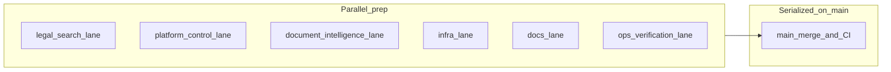

# Parallel execution plan (max concurrency)

Use this with [Parallel work streams (by component)](parallel-work-streams.md) when several people or initiatives are active. The goal is **maximum parallel prep and review** while **respecting real merge seams** on `main`.

## Principles (from repo rules)

- **Parallelize by component** when paths do not overlap: `legal-search/`, `platform-control/`, `document-intelligence/`, `infra/`, scoped docs/runbooks (see the streams table in [parallel-work-streams.md](parallel-work-streams.md)).
- **Serialize** when the same artifact is the seam: one owner per **OpenAPI file** (e.g. [`contracts/api/legal-search.openapi.yaml`](../../contracts/api/legal-search.openapi.yaml)), one owner per **Alembic migration batch**, and an agreed **event/API shape** before cross-service implementation splits across repos or packages.
- **Landing on `main` is serial** in practice (merge queue, CI capacity, conflict resolution), but **preparation** (rebase, local `npm run check`, `pytest`, review) should run **in parallel** across people and worktrees before merge.

## Execution lanes (typical max concurrency)

These lanes can move at the same time if they do not touch the same serialized artifact (OpenAPI path, migration batch, same workflow file, same hot file).

| Lane | Typical paths | Notes |
|------|----------------|--------|
| **Ops / verification** | Runbooks, post-deploy checks, staging smoke | Parallel with dev lanes; outcomes may feed small follow-up PRs in any stream |
| **legal-search** | `legal-search/**` | Serialize with others on `contracts/api/legal-search.openapi.yaml` and generated clients |
| **platform-control** | `platform-control/**` | Serialize on `contracts/api/platform-control.openapi.yaml` and shared migrations |
| **document-intelligence** | `document-intelligence/**` | Serialize on shared event/schema under `contracts/` |
| **infra** | `infra/**`, deployment configs | Often parallel to app code; coordinate when wiring references new services or secrets |
| **Docs / runbooks** | `docs/**` | Prefer one initiative per PR when possible; must match shipped behavior |

## Serialization gates (do not parallelize the same change)

| Gate | Rule |
|------|------|
| **Same OpenAPI file** | One lead PR; consumers rebase or regenerate after merge (`npm run openapi:generate` in `legal-search/` where applicable). |
| **Same Alembic migration / ORM model** | Single owner for that batch. |
| **Same GitHub Actions workflow file** | Treat like overlapping code: expect conflicts; rebase ordering or split PRs. |
| **Cross-service behavior** | Contract or event schema first, then parallel implementation in each component. |

## Stale long-lived branches and parked `pr/*` lines

Branches that are **many commits behind `origin/main`** often show a **large `git diff main <branch>`** because `main` has moved; that diff is **not** a reliable predictor of whether two stale branches can merge cleanly.

**Policy — refresh-then-land:**

1. `git fetch origin main`
2. Rebase onto current `main` (or recreate a minimal patch series if history is unusable).
3. Run the narrowest quality gates for touched paths (e.g. `npm run check` in `legal-search/`, `ruff`/`pytest` in `platform-control/`).
4. Open a **fresh PR** from the updated branch.

Until refreshed, **do not** assume two stale branches can merge cleanly in either order.

## Review freshness for solo-maintainer work

When a stale branch is refreshed by the owner, avoid review loops that do not reduce risk:

- Mechanical rebases, conflict resolution, docs wording, and CI skip clarifications can keep the prior review posture if required checks pass and the risk profile is unchanged.
- Behavior changes, contracts, migrations, Terraform resources, IAM/security, and workflow semantics need fresh review before merge.
- Required checks still apply. Admin override and GCP-disabled skip policy live in [Branch rules](../setup/branch-rules.md#solo-maintainer-policy).

## Contract-first batching

When multiple lanes need the same API or event shape:

1. Land a **small contract-first PR** (spec/schema + minimal validation or codegen).
2. Then parallel implementation PRs per component, each rebased on `main` after the contract merge.

## Related

- [Parallel work streams (by component)](parallel-work-streams.md)
- Change classification and gates: [AGENTS.md](../../AGENTS.md)
- Contract location: [ADR-0004: Contract strategy](../adr/0004-contract-strategy.md)
