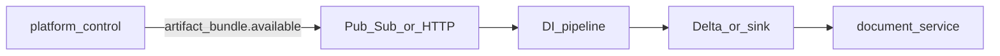

# Metadata & search quality — plan status report

Owner: Platform / legal-search  
Last reviewed: 2026-04-09 (staging evidence snapshots, 3.5.2 corpus inventory, TAR-89 staging honesty note)  
Applies to: MVP demo path, **Linear TAR-89** (search/detail metadata quality), related release gates

This report ties together the **stated plan** (runbooks + Linear) and **repo reality** (what ships in code today). Update it when TAR-89 scope closes or gates move.

---

## 1. What “the plan” refers to

| Source                                                                  | Role                                                                                                          |
| ----------------------------------------------------------------------- | ------------------------------------------------------------------------------------------------------------- |
| [MVP demo & release recommendation](mvp-demo-release-recommendation.md) | **Conditional GO**; remaining product risk called out as **TAR-89** (metadata credibility on search/detail)   |
| [Phase 5 go / no-go memo](phase-5-go-no-go-memo.md)                     | Gate table; §3 “Search and metadata quality” (projection fields **shipped**, relevance eval **pending**)      |
| [MVP website walkthrough](mvp-website-walkthrough.md)                   | Observed **high** severity: generic titles / `type: "unknown"` on result/detail                               |
| [Search relevance baseline](search-relevance-baseline.md)               | Staging eval pack for **TAR-82** / **TAR-68** (ranking baselines, separate but adjacent to metadata richness) |
| [First vertical slice exit gates](first-vertical-slice-exit-gates.md)   | End-to-end evidence expectations (includes search surface)                                                    |

**TAR-89** (Linear) is the umbrella issue for **improving search/detail metadata quality for user trust** per MVP recommendation.

---

## 2. Done (in repo or explicitly “shipped” in runbooks)

### 2.1 Legal-search projections & API surface

- **OpenSearch ranking shape** — `multi_match` boosts documented in [search-relevance-baseline.md](search-relevance-baseline.md) (`title`, `structural_path`, `regeste`, `content`, `content_preview`, `docket_number`).
- **Projection mapping** — `ProjectionsService` builds search documents from canonical lean rows; extracts nested metadata paths (e.g. `metadata.official_citation`, `metadata.original_language`, effective date, structural path). **Document type** is normalized to contract vocabulary codes when present on the lean row, with fallbacks from `metadata.source_defaults.document_type_hint`, `metadata.extracted_metadata.document_type`, and (when `applied`) `metadata.llm_extraction.document_type`, using the same alias map as document-intelligence (`statute` → `law`, etc.). **Title** falls back past placeholder `Untitled document` to LLM title (when applied), official citation, first substantive line of preview/body text (min length 24), then structural-path tail, before `Document <id>`. See `legal-search/api/src/modules/projections/projections.service.ts`.
- **Result + detail view models** — `MetadataRow` / `metadataRows` in API mappers and generated clients; **detail** renders via `MetadataSection` (`legal-search/frontend/src/components/detail/MetadataSection.tsx`). Controlled document types add an explicit **Dokumenttyp** row (vocabulary label) with `dtype-*` icons; date, citation, official source, language, authority, and status rows use stable `meta-*` icon keys mapped in `frontend/src/lib/icons.ts` (see `legal-search/api/src/core/presentation/metadata-icons.ts`).

### 2.2 Document-intelligence pipeline (canonical metadata)

- **Normalizer metadata** — Pipeline attaches `source_origin_kind`, `trust_tier`, `source_defaults`, optional `extracted_metadata`, `official_citation`, `original_language`, `translation_status`, parse fallback flags, optional **Docling** block.
- **Optional LLM seam** — `MetadataExtractor` protocol + `MetadataExtractionCandidate`; pipeline merges LLM title/type when confidence ≥ threshold. **Default off** (`DI_ENABLE_LLM_EXTRACTOR=false`). See `document-intelligence/src/document_intelligence/extractors/metadata.py`, `pipeline.py`, and [document-intelligence README](../../document-intelligence/README.md) env section.

### 2.3 Operator / release documentation

- Demo packet expectations, interaction-flow hooks, and **phase 5** workstream list (TAR-66 → TAR-62 → TAR-63 → TAR-67) documented in runbooks above.

---

## 3. Outstanding (explicit gaps)

### 3.1 TAR-89 — user-visible metadata quality (primary)

**Projection layer (legal-search):** inferring type from bundle hints and richer title fallbacks is implemented in `ProjectionsService` (2026-04-09). **Existing OpenSearch rows** still show old titles/types until projections are replayed or documents are re-processed and re-indexed.

| Gap                                             | Evidence / notes                                                                                                                                                                               |
| ----------------------------------------------- | ---------------------------------------------------------------------------------------------------------------------------------------------------------------------------------------------- |
| **Generic titles / weak document typing in UI** | [mvp-website-walkthrough.md](mvp-website-walkthrough.md) — mitigated for **new** projections when lean payloads carry hints/citations/body; verify on seeded corpus after re-projection        |
| **Trust/explainability**                        | [mvp-demo-release-recommendation.md](mvp-demo-release-recommendation.md) — “demo-quality polish (metadata credibility)”; **BFF** `MetadataRow` labels/icons still thin where facets are sparse |
| **LLM enrichment not a default path**           | Policy recorded in [document-intelligence README](../../document-intelligence/README.md) (“LLM extraction policy”): **default off**; pilot requires observability + cost bounds; BFF consumes `metadata.llm_extraction` when present |

**Likely workstreams** (not all tracked as separate issues in this file): richer **source-acquisition** metadata into bundles; **DI** normalization improvements per corpus; **re-projection / re-index** for demo envs; **BFF mapper** labels/icons for `MetadataRow`; optional **LLM** rollout with guardrails and cost/quality metrics.

### 3.2 Relevance baselines (TAR-82 / TAR-68) — adjacent

| Gap                                                     | Evidence                                                                                                              |
| ------------------------------------------------------- | --------------------------------------------------------------------------------------------------------------------- |
| **Staging query pack not attached as routine evidence** | [search-relevance-baseline.md](search-relevance-baseline.md), [phase-5-go-no-go-memo.md](phase-5-go-no-go-memo.md) §3 |

### 3.3 Release / evidence gates (block full product GO, not only TAR-89)

From [mvp-demo-release-recommendation.md](mvp-demo-release-recommendation.md) and [phase-5-go-no-go-memo.md](phase-5-go-no-go-memo.md):

| Item                            | Status in memo                                          |
| ------------------------------- | ------------------------------------------------------- |
| TAR-87, TAR-88                  | Required for **full product GO** (walkthrough evidence) |
| TAR-64                          | Dev smoke ×2 / vertical slice evidence                  |
| TAR-77                          | Branch protection proof                                 |
| TAR-85                          | Fresh staging MVP acceptance                            |
| M5 checklist / interaction-flow | Operator evidence for Pub/Sub + DI path                 |

### 3.4 Secondary UX / ops (walkthrough)

| Gap                                                        | Severity (walkthrough) |
| ---------------------------------------------------------- | ---------------------- |
| Legal-search `/docs` not exposed (404) vs platform-control | mitigated: `/docs` route on legal-search frontend (see `legal-search/frontend/src/app/docs/`); optional `NEXT_PUBLIC_EVIDARA_DOCS_BASE_URL` for hosted MkDocs                 |
| Screenshot pack attachment discipline                      | medium — see [screenshot evidence discipline](screenshot-evidence-discipline.md)                 |

---

## 3.5 TAR-89 acceptance criteria (draft)

**Linear:** criteria are in the **[TAR-89](https://linear.app/tart-baozi/issue/TAR-89/p7-7-improve-searchdetail-metadata-quality-for-user-trust)** issue description (includes pointers to **3.5.1** / **3.5.2**). **Editing procedure:** [section 5 — Keeping TAR-89 acceptance in sync](#5-how-to-refresh-this-report). Adjust corpus IDs / environments as needed. Criteria are **met** when all bullets hold for the agreed demo corpus after **re-projection** or re-index (stale OpenSearch rows do not count against the code path).

**Search / list**

- For each fixture in the agreed corpus, the search hit (or list card) shows a **non-placeholder title**: not `Untitled document`, not `Document <id>` unless no citation, body, or structural hint exists.
- For each fixture, `type` (document type) is a **controlled vocabulary code** (`law`, `decision`, …) or an explicitly documented exception — not `unknown` when `document_type`, `metadata.source_defaults.document_type_hint`, or `metadata.extracted_metadata.document_type` supplies a mappable hint on the lean row.

**Detail**

- **Dokumenttyp** appears when the projected type is controlled (existing UI rule).
- At least one of: **citation** (`official_citation` / structural path), **language**, **authority** (`source_defaults.authority_name` or equivalent), or **status** — when present on lean — surfaces as a `MetadataRow` with a stable presentation key (icon / label), not silently dropped.

**Process**

- One **document ID** is traced end-to-end with written hops (**section 6.8** for local lean fixture; **section 6.9** when the full bundle → DI path must be validated); first broken hop is fixed or tracked as a dependency with issue ID.
- Staging/demo envs: after code changes to projections or lean shape, operators run **replay** or full re-ingest so acceptance is evaluated on **fresh** index rows.

### Release / guardrails

- Representative query pack shows improved title/subtitle/metadata quality where applicable.
- No contract lock violations introduced.
- Before/after evidence attached for dev and staging where required by release gates.

### 3.5.1 Agreed demo corpus (phase 1 — local)

**Environment:** Local **`lean-stack`** ([Legal-search + lean (local)](../setup/legal-search-lean-local.md)) — Docker Compose profile `lean-stack` + `scripts/dev-lean-search-stack.sh`.

| Document ID | Lean source | Notes |
| ----------- | ----------- | ----- |
| `doc_01jq7bhgy7g0pkj4f1d03f8f8c` | [`scripts/fixtures/tar89-demo-content/doc_01jq7bhgy7g0pkj4f1d03f8f8c.json`](../../scripts/fixtures/tar89-demo-content/doc_01jq7bhgy7g0pkj4f1d03f8f8c.json) via Document Service `DOCUMENT_SERVICE_CONTENT_DIR` | TAR-89 reference trace (section 6.8); not produced by DI in this path |

**Verification (after replay):** from repo root, with stack up: `./scripts/dev-lean-search-stack.sh replay` (or `validate-tar89-metadata-local.sh --replay --search`). Then:

1. Search API returns the doc with **non-placeholder** title and `document_type` consistent with acceptance (section 3.5 **Search / list**).
2. `GET …/v1/documents/doc_01jq7bhgy7g0pkj4f1d03f8f8c/lean` matches fixture fields (**Process** / section 6.8).

**Sign-off:** product still **extends** this table for staging document IDs and records dates in Linear **TAR-89** comments; keep this subsection in sync when the agreed list grows.

**Last automated local verify:** 2026-04-09 — `./scripts/dev-lean-search-stack.sh replay` returned `applied`; search snippet showed `decision` type, non-placeholder title, and `metadataRows` including Dokumenttyp, Fundstelle, Quelle, Sprache (matches section 3.5 Search / list, Detail, and Process for this ID).

### 3.5.2 Staging / extended corpus (product-owned)

**Staging BFF (2026-04-09 snapshot):** `https://legal-search-api-staging-kxc5agexna-oa.a.run.app` (see [`infra/env/staging/runtime.gcp.tfvars.example`](../../infra/env/staging/runtime.gcp.tfvars.example)). Hostnames may drift with deploys — re-verify URLs before release.

Corpus = **7** indexed documents (search `totalResults`); list hits still show generic titles / `unknown` type on several rows — **metadata acceptance** (section 3.5) is **not** fully met for staging until re-projection or richer lean (tracked in section 3.1). This table records **which IDs exist** for demo/trace work.

| Document ID | Environment URL (legal-search API or UI) | Notes |
| ----------- | ------------------------------------------ | ----- |
| `doc_49n3ksesast1e2gbw1b7zev9q7` | Staging API above | First hit in MVP acceptance detail check (2026-04-09) |
| `doc_7gnw34z8hfsnbqnn24c4fj6n7e` | same | Search result |
| `doc_61gpg0hbc0pjybgzxyavevezpt` | same | Search result |
| `doc_68hvf0fnv25gygr013j9hhkng3` | same | Search result |
| `doc_2bwv3jzjvwc2xmhx7xbdddd6j3` | same | Search result |
| `doc_2zgbt902hbby5mhzpmygrr2tfv` | same | Search result |
| `doc_54j7r37eqp2nzzxak5qes5eghp` | same | Search result |

**Procedure:** (1) Pick IDs from staging search/detail that must read well for demos. (2) If projections are stale after a BFF/DI change, use [staging projection replay](staging-projection-replay.md) or full re-ingest. (3) Verify search + detail against section 3.5 **Search / list** and **Detail**. (4) Add a short **sign-off** comment on Linear **TAR-89** with date and link to this table row(s) (**3.5.3**) only when criteria are **actually met** (replay alone does not fix missing lean metadata).

Phase-1 local corpus (**3.5.1**) remains the **clean** reference for passing TAR-89 criteria in CI-like conditions; staging rows above are **inventory + honesty** about current staging metadata quality.

### 3.5.3 Formal sign-off (Linear TAR-89)

Post a short comment on **TAR-89** when staging rows in **3.5.2** are verified, for example:

> TAR-89 acceptance sign-off — **YYYY-MM-DD** — Environment: **staging** — Document IDs: **…** — Replay/re-index: **yes** (how) — Checked search + detail against section 3.5 criteria: **pass** — Owner: **name**

---

## 4. Suggested next actions (ordered)

1. **TAR-89 acceptance** — Use **section 3.5.1** (local) and **3.5.2** (staging list) as the agreed corpus; sign off in Linear **TAR-89** after checks pass.
2. **Trace one demo document** — Use §6.8 as the reference trace; extend to full bundle → DI processing when validating pipeline changes (not only file-backed lean).
3. **LLM extractor** — **Default remains off** for staging/prod until explicitly enabled; policy and toggles are documented in [document-intelligence README](../../document-intelligence/README.md) (“LLM extraction policy”). Turning **on** requires observability (confidence, failure rate) and cost bounds — track as follow-up issues when product approves a pilot.
4. **Run staging relevance pack** per [search-relevance-baseline.md](search-relevance-baseline.md); record results with [relevance-eval-result-template.md](relevance-eval-result-template.md) and attach to **TAR-82** / **TAR-68** (comments on those issues point to these runbooks).
5. **Close gate issues** (TAR-64, TAR-77, TAR-85; TAR-87 / TAR-88 for full GO) — evidence steps in [m5-evidence-checklist.md](m5-evidence-checklist.md) and [tar64-tar85-evidence-capture.md](tar64-tar85-evidence-capture.md); Linear comments on each issue link to the matching section.

**Week-shaped cut (2026-04-09):** acceptance criteria in Linear **TAR-89** + section 3.5 here, section 6.8 (reference trace), LLM policy in DI README, and [document-intelligence implementation plan](../components/document-intelligence-implementation-plan.md) reconciled with repo reality.

6. **Parallel engineering (DI)** — Terraform + Databricks bundle CI/CD, golden/XML quality, citations, jurisdiction: see [document-intelligence implementation plan](../components/document-intelligence-implementation-plan.md) **Immediate next steps**; track against platform milestones separately from metadata acceptance above.

---

## 5. How to refresh this report

- After each **website walkthrough** or **MVP acceptance** run, update §3 against new observations.
- When **TAR-89** is closed, move remaining bullets to “Done” or delete; bump **Last reviewed**.
- If scope splits (e.g. DI vs BFF vs frontend), add subsections with issue IDs.

### Keeping TAR-89 acceptance in sync

Acceptance lives in **two places**: Linear **[TAR-89](https://linear.app/tart-baozi/issue/TAR-89/p7-7-improve-searchdetail-metadata-quality-for-user-trust)** (issue description, **Acceptance criteria**) and **section 3.5** of this file.

When you change wording:

1. Edit **section 3.5** here (canonical for git history and review).
2. Apply the **same** text to the TAR-89 description in Linear (or paste from Linear into 3.5 if Linear was edited first — end state must match).
3. If the **reference trace** (section 6.8) or demo document ID changes, update **both** section 6.8 and the **Process** bullet in TAR-89 / 3.5.

---

## 6. Local stack vs upstreams (projection + metadata validation)

Use this when validating **§3.1** fixes: you need to know which process talks to which URL, and what “local” actually means versus staging/prod.

### 6.1 Components

| Piece                      | Role                                                                                            | Typical local                                                                                                                             | Staging / prod                |
| -------------------------- | ----------------------------------------------------------------------------------------------- | ----------------------------------------------------------------------------------------------------------------------------------------- | ----------------------------- |
| **legal-search frontend**  | Next.js UI                                                                                      | `localhost` (dev server)                                                                                                                  | Hosted URL                    |
| **legal-search API (BFF)** | NestJS: search, detail, **projection ingestion**                                                | `PORT` (e.g. 3102)                                                                                                                        | Cloud Run / k8s URL           |
| **OpenSearch**             | Search index + **projection document** store (via adapter)                                      | `OPENSEARCH_NODE` e.g. `http://localhost:9200`                                                                                            | Managed cluster               |
| **Document Service**       | document-intelligence **read** API: `GET /v1/documents/{id}/lean`                               | Python service; default listen port from `PORT` or `DOCUMENT_SERVICE_PORT` (**8090** in `document_intelligence/service/main.py` if unset) | Same contract, cloud URL      |
| **DI processing**          | Pipeline / Databricks / consumer — **writes** published surfaces and emits `document.processed` | CLI, local consumer, or remote job                                                                                                        | Databricks / runtime consumer |

**Upstream** for the BFF means: **OpenSearch** (always for search + stored projections) and **Document Service** (when `DOCUMENT_INTELLIGENCE_BASE_URL` is set — projections and detail body both lean on this; if unset, lean fetch returns null and projections use event-only fallbacks).

### 6.2 Environment variables (legal-search API)

See `legal-search/api/.env.example`:

- `DOCUMENT_INTELLIGENCE_BASE_URL` — Origin of the Document Service (no trailing slash). **Must match** the host/port where `document_intelligence_document_service` is listening.
- `OPENSEARCH_NODE`, `OPENSEARCH_INDEX_DOCUMENTS`, `OPENSEARCH_INDEX_SECTIONS`
- `DOCUMENT_INTELLIGENCE_API_KEY` — When the Document Service expects bearer auth.

### 6.3 End-to-end path (one document)

1. **Published lean JSON** exists where the Document Service can read it (e.g. `DOCUMENT_SERVICE_CONTENT_DIR` file store in dev, or Delta/SQL in deployed DI).
2. `document.processed` is delivered to the BFF (Pub/Sub push in cloud, or manual HTTP in dev).
3. **Projection handler** calls `GET …/v1/documents/{document_id}/lean` (optional `document_revision`), runs `ProjectionsService.buildProjection`, then **upserts** into OpenSearch.
4. **Search / detail** read metadata from OpenSearch (and detail may call Document Service again for body).

### 6.4 Re-running projections (“replay”) in dev

- HTTP endpoint: `POST /v1/projections/events/document-processed` on the legal-search API (body = contract-shaped `document.processed` payload). See integration tests in `legal-search/api/src/__tests__/integration.spec.ts` for a minimal example.
- **Deduplication:** the service stores `event_id`. The same `event_id` is answered with `ignored_duplicate` and does **not** re-fetch lean or refresh OpenSearch. To force a refresh after changing BFF logic or DI lean content, post again with a **new** `event_id` (and ensure `document_revision` is not **stale** vs the index — see `ProjectionsService` stale rules).

### 6.5 Quick manual checks

1. **Lean shape (DI → BFF input):** `GET {DOCUMENT_INTELLIGENCE_BASE_URL}/v1/documents/{document_id}/lean` — confirm `title`, `document_type`, `metadata.source_defaults`, `metadata.official_citation`, etc.
2. **Projection write:** POST `document-processed` as above; confirm API returns `applied`. From repo root you can use **`scripts/replay-document-projection.sh`** with a saved JSON payload (see **`scripts/fixtures/document-processed.example.json`**) — the script injects a new `event_id` and current `occurred_at` on each run.
3. **UI / API:** Search or document detail for that `document_id` — `type` and title should reflect the new projection row (not cached in the BFF; index refresh depends on OpenSearch read-your-writes).

### 6.6 Scripted local path (steps 1 + 2)

**Easiest path (recommended):** [`scripts/dev-lean-search-stack.sh`](../../scripts/dev-lean-search-stack.sh) — `up` runs **`docker compose --profile lean-stack`** (OpenSearch, Document Service, bootstrap, API on **3102**); `replay` posts `document.processed` and curls search. For host hot reload, use `up-split` + `print-env` + `npm run dev`. See [Legal-search + lean (local)](../setup/legal-search-lean-local.md).

**Manual / piecemeal:**

1. Start OpenSearch: `docker compose --profile search up -d` (repo root), or `docker compose --profile search --profile lean up -d` to include the **Document Service** container.
2. **`./scripts/validate-tar89-metadata-local.sh --bootstrap`** — creates `documents-write`, **`documents-read` alias → `documents-write`**, indexes a **stale** placeholder doc `doc_01jq7bhgy7g0pkj4f1d03f8f8c`.
3. If you did not start the **`lean`** profile: run Document Service with **`DOCUMENT_SERVICE_CONTENT_DIR`** → `scripts/fixtures/tar89-demo-content/`.
4. Terminal B — API: `cd legal-search/api` with `OPENSEARCH_NODE`, **`OPENSEARCH_ALIAS_READ=documents-read`**, **`OPENSEARCH_ALIAS_WRITE=documents-write`**, **`DOCUMENT_INTELLIGENCE_BASE_URL=http://127.0.0.1:8090`**, then `npm run dev`.
5. **Replay + search:** `./scripts/dev-lean-search-stack.sh replay` or **`./scripts/validate-tar89-metadata-local.sh --replay --search`**. Payload: **`scripts/fixtures/tar89-document-processed.template.json`**.

**Refresh existing corpus (step 2):** any document already in OpenSearch needs a **new** `event_id` per replay (or your normal Pub/Sub redelivery). The bootstrap script models that by seeding a stale doc and overwriting it when projection applies.

### 6.7 What is *not* implied by “local”

- Local BFF + local OpenSearch **does not** automatically use staging DI or staging data unless `DOCUMENT_INTELLIGENCE_BASE_URL` and published content point there.
- Conversely, pointing `DOCUMENT_INTELLIGENCE_BASE_URL` at staging while using **local** OpenSearch yields **local search results** built from **remote** lean payloads — useful for debugging projection mapping without processing bundles locally.

### 6.8 Reference trace — TAR-89 demo document (`doc_01jq7bhgy7g0pkj4f1d03f8f8c`)

Local lean fixture: [`scripts/fixtures/tar89-demo-content/doc_01jq7bhgy7g0pkj4f1d03f8f8c.json`](../../scripts/fixtures/tar89-demo-content/doc_01jq7bhgy7g0pkj4f1d03f8f8c.json). This path validates **metadata projection** without running the full DI bundle pipeline (lean is served as if already published).

| Hop | What to check | Expected for this fixture |
| --- | ------------- | ------------------------- |
| 1. Lean file | JSON on disk | `title` set; `document_type` = `decision`; `metadata.official_citation`, `metadata.source_defaults.document_type_hint` (`urteil` → maps to `decision`), `authority_name` present |
| 2. Document Service | `GET …/v1/documents/doc_01jq7bhgy7g0pkj4f1d03f8f8c/lean` | Same fields visible on the wire |
| 3. Projection | `POST …/document-processed` then OpenSearch `GET` / search API | `title` from lean; `document_type` = `decision`; `official_citation` populated |
| 4. Detail metadata rows | API `metadataRows` / UI | Type row + citation / authority rows when mappers emit them for these facets |

**Gap status (2026-04-09):** No code defect found on this trace for the file-backed lean stack; remaining risk is **stale index rows** until replay (section 6.4) and **staging corpus** coverage beyond this single JSON.

### 6.9 Full processing path (bundle → DI → published lean)

Use this when validating **document-intelligence** changes (normalization, metadata, published shape). It extends section 6.3 with **upstream** hops before lean exists in the Document Service.

| Hop | Component | What to check |
| --- | --------- | ------------- |
| 1. Bundle handoff | `platform-control` | Immutable bundle manifest + artifacts in GCS; `artifact_bundle.available` emitted per contract ([`contracts/events/`](../../contracts/events/)). |
| 2. Intake | DI runtime consumer or HTTP ingress | Event decoded; manifest + primary artifact loaded ([`document-intelligence/README.md`](../../document-intelligence/README.md), `document_intelligence_runtime_consumer` / ingress). |
| 3. Processing | `ProcessingPipeline` | Canonical `Document` / `Section` / `ProcessingManifest`; `document.processing_status.updated` and `document.processed` built ([`document_intelligence/pipeline.py`](../../document-intelligence/src/document_intelligence/pipeline.py)). |
| 4. Published surface | Delta (deployed) or in-memory / CLI sink | Rows or test sink contain the document revision the read API will serve. |
| 5. Read API | Document Service | `GET /v1/documents/{id}/lean` returns expected `title`, `document_type`, `metadata.*`. |
| 6–8. | legal-search | Same as section 6.3 (projection event → OpenSearch → search/detail). |

Local **lean-stack** (section 6.6) **skips hops 1–4** by using a file-backed fixture instead of DI output; use the **full** path when those hops must be green.

## Related links

- [Document service & detail](document-service-document-detail.md)  
- [ADR-0014 — DI pipeline integration](../adr/0014-document-intelligence-pipeline-integration.md)  
- [Nix dev shell](../setup/nix.md) (tooling for local Terraform/scripts)