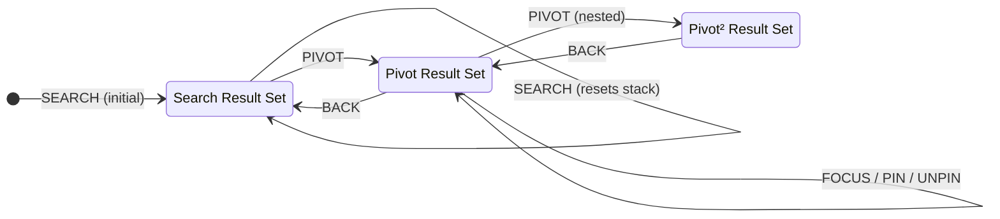

# State Management

> Workspace state, reducer patterns, and the planned URL-driven migration.

---

## Current Architecture

> Source: [`workspace-store.tsx`](../src/lib/workspace-store.tsx)

React Context + `useReducer` pattern. Single `WorkspaceProvider` wraps the entire app.

### State Shape

```typescript
interface WorkspaceState {
  resultSet: ResultSet;           // Current visible result set (center column)
  resultSetStack: ResultSet[];    // Previous sets for BACK navigation
  focusedId: string | null;       // Drives right panel content
  trail: TrailEntry[];            // Focus history (append-only)
  pinned: PinnedItem[];           // Persisted across pivots
}
```

### Result Set

Each `ResultSet` tracks its provenance:

```typescript
interface ResultSet {
  source: ResultSetSource;             // Where these results came from
  items: SearchResultViewModel[];      // The actual results
  scopeLabel: string;                  // Display label (e.g. "Results for 'Art. 754'")
}

type ResultSetSource =
  | { type: "search"; query: string }
  | { type: "pivot"; label: string; parentSource: ResultSetSource };
```

The `parentSource` forms a linked list — you can trace any pivot back to its root search.

---

## Reducer Actions

### `SEARCH`

```
Trigger:  AppHeader form submit
Effect:   Replace resultSet, clear stack, auto-focus first result
State:    resultSet ← new, resultSetStack ← [], focusedId ← items[0].id
```

### `FOCUS`

```
Trigger:  ResultCard click, RelatedTab item click, ReferencesTab item click, StructureTab item click
Effect:   Set focusedId, append to trail
State:    focusedId ← action.id, trail ← [...trail, { id, title, type, timestamp }]
```

### `PIVOT`

```
Trigger:  ResultCard relatedCount click, DetailPanel "Show all" button
Effect:   Push current set to stack, load new result set
State:    resultSetStack ← [...stack, currentSet], resultSet ← new, focusedId ← items[0].id
```

### `BACK`

```
Trigger:  ResultSetScopeBar back button
Effect:   Pop stack, restore previous set
State:    resultSet ← stack.pop(), focusedId ← items[0].id
Guard:    No-op if stack is empty
```

### `PIN` / `UNPIN`

```
Trigger:  ResultCard pin button, DetailPanel pin button
Effect:   Add/remove from pinned list
Guard:    PIN is idempotent (no duplicates)
State:    pinned ← [...pinned, item] or pinned.filter(p => p.id !== id)
```

---

## State Machine



**Orthogonal state**: `focusedId`, `trail`, and `pinned` are independent of the result set stack. Pins persist across pivots and BACKs.

---

## Context API

```typescript
interface WorkspaceContextValue {
  state: WorkspaceState;
  dispatch: Dispatch<WorkspaceAction>;
  getDetail: (id: string) => DetailViewModel | null;  // Lookup from detailMap
}
```

### Provider Setup

```typescript
<WorkspaceProvider
  initialResults={searchResults}    // Mock data → future: initial SSR fetch
  initialQuery="Art. 754 OR ..."    // Initial search query
  detailMap={detailMap}             // Record<id, DetailViewModel> → future: async BFF fetch
>
```

### Consumer Hook

```typescript
const { state, dispatch, getDetail } = useWorkspace();
```

Used by: `WorkspaceShell`, `AppHeader`, `ResultSetScopeBar`.

---

## Derived State (computed in WorkspaceShell)

| Derived | Computation | Used by |
|---------|-------------|---------|
| `pinnedIds` | `new Set(state.pinned.map(p => p.id))` | ResultCard, DetailPanel (isPinned check) |
| `detail` | `state.focusedId ? getDetail(focusedId) : null` | DetailPanel |
| `canGoBack` | `state.resultSetStack.length > 0` | ResultSetScopeBar |

---

## Memoized Callbacks (WorkspaceShell)

| Callback | Dependencies | Dispatches |
|----------|-------------|------------|
| `handleFocus` | `[dispatch]` | `FOCUS` |
| `handlePivot` | `[dispatch, state.resultSet]` | `PIVOT` |
| `handlePin` | `[dispatch, state.pinned]` | `PIN` or `UNPIN` (toggle) |

---

## Planned Migration: URL-Driven Selection

> Source: [Responsive Layout Plan](../../.gemini/antigravity/brain/64dc9795-0b49-44bb-be0a-a0e5c352e678/implementation_plan.md)

### What Changes

| Current | Future |
|---------|--------|
| `focusedId` lives in reducer state | `selectedId` comes from URL `?item=` param |
| `FOCUS` action updates state | URL update via `router.replace()` |
| Right panel always visible | Right panel **collapses** when no `?item=`, expands on selection |
| No URL state | Deep-linkable: `?item=law-1` opens detail directly |

### Migration Strategy

The plan keeps `FOCUS` in the reducer (for trail tracking) but treats the URL as source of truth for _which item is selected_. The `WorkspaceClient` component:

1. Reads `useSearchParams().get("item")` → `selectedId`
2. On result click: `router.replace(?item=id)` + dispatches `FOCUS` (for trail)
3. Right panel expands/collapses via `ImperativePanelHandle` based on `selectedId`
4. Escape key → collapses right panel, removes `?item=`
5. Browser back/forward → panel state follows URL

### Mobile Adaptation

On `< 1024px` (determined by `useDesktop()` hook):
- Filters → `Sheet` from left
- Detail → `Sheet` from right (driven by `?item=`)
- Center panel = full-width result list

### Panel Persistence

`autoSaveId="workspace-layout"` on `ResizablePanelGroup` → panel sizes persist in `localStorage`.
