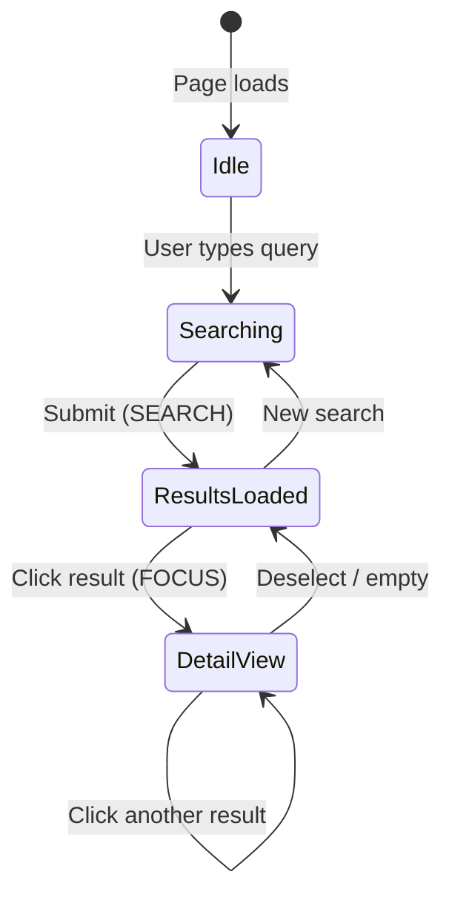
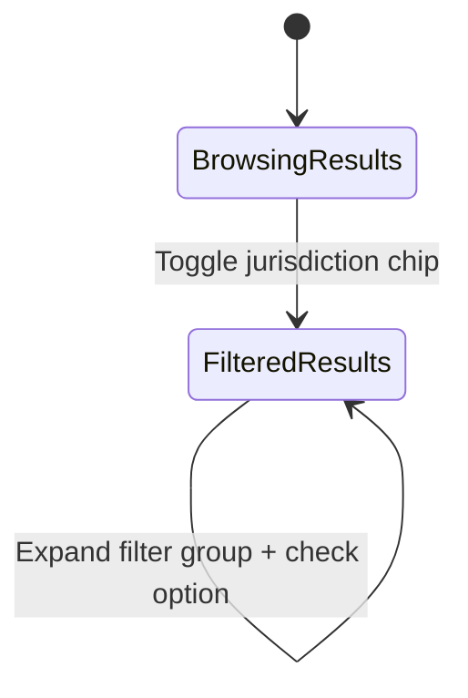
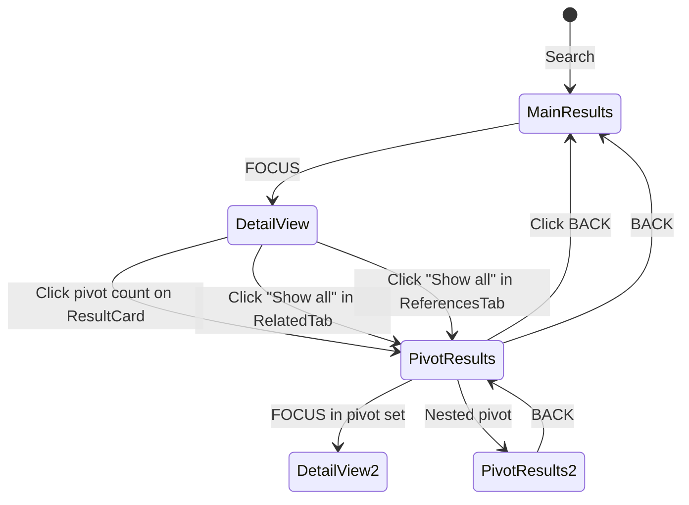
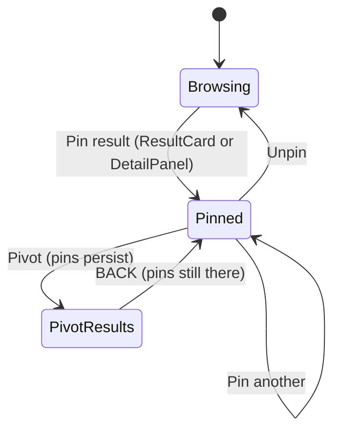
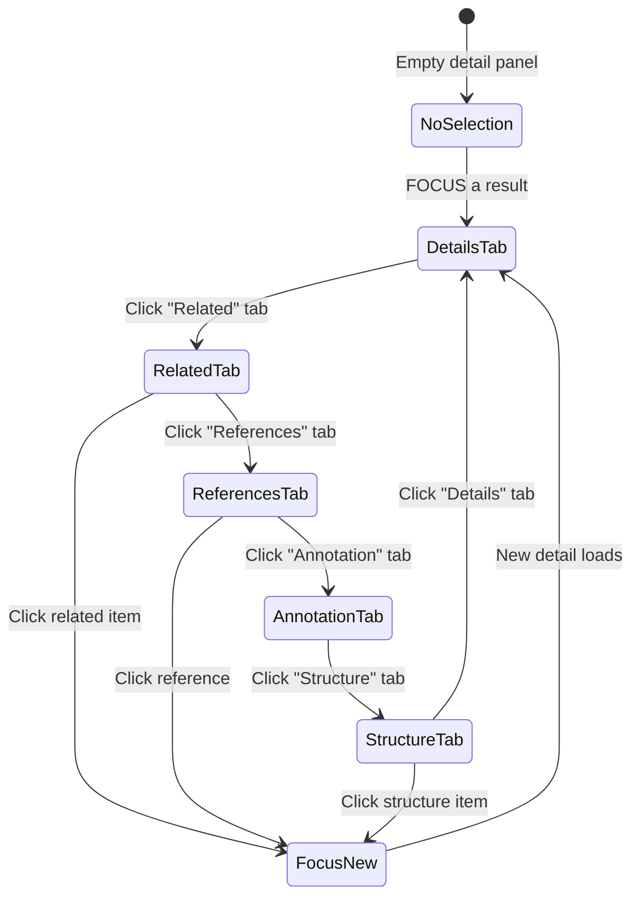
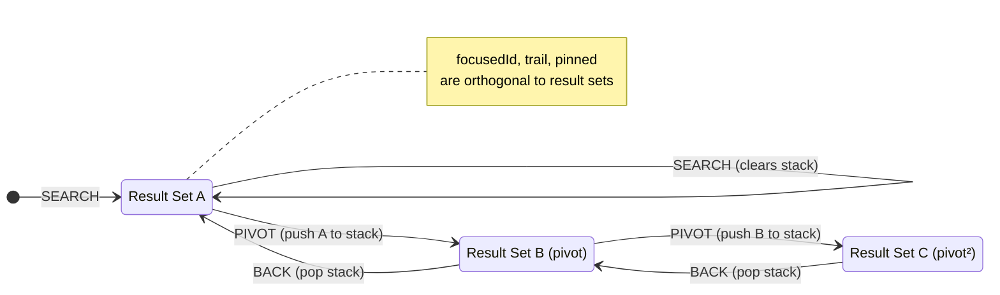

# User Flows & Interaction Design

> High-level user journeys through the Evidara legal research workspace.

---

## Core Interaction Model: Anchor → Discover → Move

The workspace follows a three-phase research loop:

```
   ┌──────────┐     ┌──────────┐     ┌──────────┐
   │  ANCHOR  │────▶│ DISCOVER │────▶│   MOVE   │
   │ (Search) │     │ (Browse) │     │ (Pivot)  │
   └──────────┘     └──────────┘     └──────────┘
        │                                  │
        └──────────────────────────────────┘
                    New anchor
```

| Phase | User Intent | UI Region | Key Action |
|-------|------------|-----------|------------|
| **Anchor** | Enter a search query or navigate to a known item | Header search bar | `SEARCH` dispatch |
| **Discover** | Scan results, read details, examine relationships | Center + Right panels | `FOCUS` dispatch |
| **Move** | Follow a relationship to explore a new result set | Result pivots, Detail "Show all" | `PIVOT` dispatch |

---

## Flow 1 — Search & Browse



**Steps:**
1. User types a legal query in the header search bar (e.g., `Art. 754 OR Verantwortlichkeit`)
2. Submits → `SEARCH` action replaces the center panel result set
3. First result is auto-focused → right panel loads its detail
4. User clicks a different result → `FOCUS` updates the right panel
5. Trail (header badge) increments with each focus

---

## Flow 2 — Context Filtering



**Layers of filtering (top → left):**
1. **ContextBar** (horizontal, always visible):
   - Jurisdiction chips — multi-select (🇨🇭 Schweiz, 🇦🇹 Österreich, cantons)
   - Language chips — multi-select (DE, FR, IT, EN)
   - Source type tabs — exclusive select (Alle, Gesetze, Entscheide, Kommentar)
   - Official sources toggle
2. **FilterPanel** (left sidebar):
   - Expandable groups with checkbox, chip, dropdown, or toggle controls
   - In-group search for facets with >5 options

> **Note:** Filters are currently local state only — not yet wired to BFF/search.

---

## Flow 3 — Pivot (Drill into relationships)



**How it works:**
1. User sees related counts on a ResultCard (e.g., "12 Entscheide", "3 Kommentare")
2. Clicks a count → `PIVOT` pushes the current result set to the stack and loads related items
3. The `ResultSetScopeBar` shows the pivot context + a BACK button
4. User can pivot again (nested) — each level pushes to the stack
5. BACK pops the stack, restoring the previous result set

**Also triggered from DetailPanel:**
- "Show all" in RelatedTab → pivots with the group label
- "Show all" in ReferencesTab → pivots with direction + source title

---

## Flow 4 — Pin & Collect



**Behavior:**
1. Pin button appears on hover (ResultCard) or always visible (DetailPanel)
2. Pins persist across pivots and BACKs — they survive result set changes
3. Header "Pinned" NavLink shows the count badge
4. Same button toggles pin/unpin (visual: blue highlight when pinned)

---

## Flow 5 — Detail Exploration



**Tabs and their purpose:**

| Tab | Content | Actions |
|-----|---------|---------|
| **Details** | Metadata rows + rendered HTML content (serif font) | Read-only |
| **Related** | Grouped related items (e.g., "Entscheide", "Rechtssätze") | Click item → FOCUS, "Show all" → PIVOT |
| **References** | Incoming/outgoing legal references | Click item → FOCUS, "Show all" → PIVOT |
| **Annotation** | AI-generated or editorial annotations with provenance | Read-only, confidence badges |
| **Structure** | Local document TOC (e.g., surrounding articles) | Click item → FOCUS, active item highlighted |

**Additional detail actions:**
- **Pin** button — toggle pin for the focused item
- **Copy** button — copies title to clipboard
- **Translation indicator** — amber badge when content is machine-translated

---

## Workspace State Transitions (complete)



---

## Screen Regions & Responsibilities

```
┌──────────────────────────────────────────────────────────────┐
│  AppHeader                                                    │
│  [Logo] [═══════ Search Bar ═══════] [Trail 3] [Pinned 1] [U]│
├──────────────────────────────────────────────────────────────┤
│  ContextBar                                                   │
│  [🇨🇭 CH] [🇦🇹 AT] │ [DE] [FR] │ [Alle│Gesetze│Entscheide] │ 🛡 Official │
├────────┬────────────────────────┬────────────────────────────┤
│ Filter │  Center: Results       │  Right: Detail             │
│ Panel  │                        │                            │
│        │  ┌─ ScopeBar ────────┐ │  ┌─ Breadcrumbs ─────────┐│
│ [▼ Jur]│  │ ← Back │ scope   │ │  │ CH > OR > Art. 754     ││
│ [▼ Doc]│  └────────────────────┘ │  ├─ Title + Pin + Copy ──┤│
│ [▼ Dat]│  ┌─ ResultCard ──────┐ │  ├─ Tabs ────────────────┤│
│ [▼ Lan]│  │ Title      [LAW]  │ │  │ Details│Related│Refs   ││
│ [▼ Off]│  │ Subtitle          │ │  ├────────────────────────┤│
│        │  │ Snippet text...   │ │  │ Content area           ││
│  18%   │  │ 12 Dec · 3 Komm   │ │  │ (scrollable)           ││
│        │  └────────────────────┘ │  │                        ││
│        │        46%              │         36%               ││
└────────┴────────────────────────┴────────────────────────────┘
```
