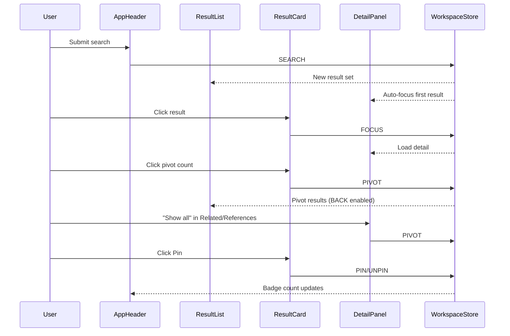

# Architecture — Component Hierarchy & Data Flow

> Function-level map of every React component in Evidara Legal Search, its CSS surface, state, and interaction logic.

---

## Component Tree

```
RootLayout (layout.tsx)                       [Server Component]
└── Home (page.tsx)                           [Client — "use client"]
    └── WorkspaceProvider                     [Context + useReducer]
        └── WorkspaceShell                    [3-column layout orchestrator]
            ├── AppHeader                     [Search bar, nav, user]
            │   └── NavLink ×2               [Trail, Pinned — with badge counts]
            │
            ├── ContextBar                    [Jurisdiction/language/source filters]
            │   ├── ChipGroup ×2             [Jurisdiction chips, Language chips]
            │   └── TabGroup                 [Source type tabs]
            │
            └── ResizablePanelGroup          [react-resizable-panels, horizontal]
                ├── Left Panel (18%)
                │   └── FilterPanel
                │       └── FilterGroup ×N   [chip | checkbox | dropdown | toggle]
                │
                ├── Center Panel (46%)
                │   ├── ExactMatchStrip      [Highlighted direct matches]
                │   │   └── Badge ×N         [primitives/Badge]
                │   └── ResultList
                │       ├── ResultSetScopeBar [Scope + ActionTextLink BACK]
                │       └── ResultCard ×N    [Title, Badge, snippet, AccentButton]
                │
                └── Right Panel (36%)
                    └── DetailPanel          [Tabbed detail view]
                        ├── Breadcrumbs
                        ├── DetailPanelHeader [Title, AccentButton pin/copy]
                        ├── DetailTabs       [URL-driven tab switcher]
                        ├── DetailsTab
                        │   └── MetadataList
                        ├── RelatedTab       [SectionLabel + InteractiveRow + ActionTextLink]
                        ├── ReferencesTab    [SectionLabel + InteractiveRow + ActionTextLink]
                        ├── AnnotationTab    [AI/editorial annotations]
                        ├── StructureTab     [Local document TOC]
                        └── EmptySection     [Shared empty state]

Primitives (src/components/primitives/):
  SectionLabel, InteractiveRow, AccentButton, ActionTextLink, Badge
```

---

## Panel Sizing

| Panel | Default | Min | Max | Content |
|-------|---------|-----|-----|---------|
| Left | 18% | 14% | 25% | `FilterPanel` |
| Center | 46% | 30% | — | `ExactMatchStrip` + `ResultList` |
| Right | 36% | 25% | 45% | `DetailPanel` |

All panels: `h-full overflow-y-auto bg-surface-panel`. Left/right have `border-r`/`border-l`.

---

## State Management

> [`workspace-store.tsx`](../src/lib/workspace-store.tsx) — React Context + `useReducer`

### State Shape

| Field | Type | Drives |
|-------|------|--------|
| `resultSet` | `ResultSet` | Center panel (items + scope label) |
| `resultSetStack` | `ResultSet[]` | BACK navigation history |
| `focusedId` | `string \| null` | Right panel detail view |
| `trail` | `TrailEntry[]` | Header "Trail" badge count |
| `pinned` | `PinnedItem[]` | Header "Pinned" badge count |

### Actions

| Action | Effect |
|--------|--------|
| `SEARCH` | Replace result set, clear stack, auto-focus first |
| `FOCUS` | Set `focusedId`, append to trail |
| `PIVOT` | Push current set to stack, load new pivot results |
| `BACK` | Pop stack → restore previous result set |
| `PIN` / `UNPIN` | Add/remove from pinned list |

---

## Component Detail

### AppHeader

- **State**: Local `query` string for search input
- **Actions**: `SEARCH` on form submit
- **Sub**: `NavLink` — renders Trail/Pinned with live badge counts from workspace state

### ContextBar

- **State**: Local arrays for `jurisdictions`, `languages`, `sourceTypes`, `officialOnly`
- **Sub**: `ChipGroup` (multi-select toggle), `TabGroup` (exclusive select)

### FilterPanel → FilterGroup

- **State**: Local `expanded`, `selected[]`, `searchQuery`
- **Renders**: 4 filter types — chip, checkbox (with in-filter search if >5 options), dropdown, toggle

### ResultList → ResultCard

- **Props-driven** (no local state)
- **Interactions**: Card click → `FOCUS`, pivot count click → `PIVOT`, pin button → `PIN`/`UNPIN`
- **Hover reveal**: Action bar fades in via `opacity-0 group-hover:opacity-100`

### DetailPanel

- **State**: `activeTab` — switches between details/related/references/annotation/structure
- **Sub-components**: `Breadcrumbs`, `DetailsTab` (metadata + HTML content), `RelatedTab`, `ReferencesTab`, `AnnotationTab`, `StructureTab`
- **Interactions**: Tab switching, pin/copy buttons, "Show all" → `PIVOT`, item click → `FOCUS`

---

## Data Flow



---

## Transition & Animation Inventory

| Pattern | Mechanism | Components |
|---------|-----------|------------|
| Hover color swap | `transition-colors` | NavLink, ChipGroup, TabGroup, buttons |
| Hover reveal | `opacity-0 group-hover:opacity-100 transition-opacity` | ResultCard action bar |
| Selected accent | `border-l-2 border-l-brand` | ResultCard, StructureTab |
| Tab underline | `border-b-2 border-brand` + `transition-colors` | DetailTabs |
| Toggle slide | `transition-transform translate-x-*` | FilterGroup toggle switch |
| Chip toggle | `transition-all` + bg/text swap | ChipGroup, FilterGroup chips |
| Focus ring | `focus:ring-2 ring-focus-ring` | Search input |
| Hover shadow | `hover:shadow-sm transition-all` | ExactMatchStrip buttons |

---

## Design Tokens

Full token reference in [design-system.md](./design-system.md). Key tokens:

| Token | Tailwind | Usage |
|-------|----------|-------|
| `--brand` | `text-brand`, `bg-brand` | Active states, focus rings, links |
| `--brand-strong` | `bg-brand-strong` | Wordmark, active chips |
| `--surface-page` | `bg-surface-page` | Workspace shell background |
| `--surface-panel` | `bg-surface-panel` | All panel content |
| `--font-serif` via `.font-document` | `font-document` class | Legal content (snippets, annotations) |
| `--font-inter` | `font-sans` | All UI text |
| `--border` | `border-border` | Panel/section borders |
| `--muted` | `bg-muted` | Inactive chip bg, hover states |
| `--radius` | `rounded-*` | Base `0.625rem` token |
