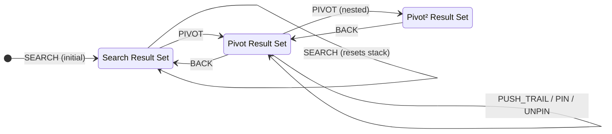

# State Management

> Workspace state, search constraints, URL-driven selection, and server data caching.

---

## Architecture Overview

The application separates state into **five distinct concerns**, each with its own owner:

| Concept | Owner | Mechanism | What It Holds |
|---------|-------|-----------|---------------|
| **Search Constraints** | `SearchConstraintsProvider` | `nuqs` URL query state + context façade | Jurisdictions, languages, source type, refinement filters |
| **Workspace Navigation** | `WorkspaceProvider` | `useReducer` (local) + context façade | Result sets, pivot stack, trail, pins |
| **Selection** | URL `?item=` | `useSearchParams` + router updates | Which item is focused (shareable, deep-linkable) |
| **Detail Tab** | URL `?tab=` | `useSearchParams` + router updates | Active detail panel tab |
| **Server Data** | React Query | `useQuery` via `useDetail()` | Detail view models (cached, deduped) |

### Provider Hierarchy

```
<Providers>                          ← Query client + NuqsAdapter
  <Suspense>
    <SearchConstraintsProvider>      ← URL-synced search constraints (nuqs)
      <WorkspaceProvider>            ← manages result sets + navigation (local)
        <WorkspaceClient />          ← orchestrates URL + providers + layout
      </WorkspaceProvider>
    </SearchConstraintsProvider>
  </Suspense>
</Providers>
```

---

## 1. Search Constraints (`SearchConstraintsProvider`)

> Source: [`search-constraints-store.tsx`](../src/lib/search-constraints-store.tsx)

High-level search parameters that scope _what_ gets searched. These are persisted in URL query parameters via `nuqs`, exposed behind a context facade so existing UI components keep a dispatch-style API. Conceptually separate from
_how_ results are navigated (that's the workspace).

### State Shape

```typescript
interface SearchConstraintsState {
  context: ContextConstraints;     // Jurisdictions, languages, source type, officialOnly
  refinements: SearchRefinement[]; // Fine-grained filters (terms, date_range, toggle, etc.)
}
```

### Actions (URL-backed)

| Action | Trigger | Effect |
|--------|---------|--------|
| `TOGGLE_JURISDICTION` | ContextBar chip click | Add/remove jurisdiction |
| `TOGGLE_LANGUAGE` | ContextBar chip click | Add/remove language |
| `SET_SOURCE_TYPE` | ContextBar tab click | Switch source type filter |
| `SET_OFFICIAL_ONLY` | ContextBar toggle | Toggle official sources flag |
| `SET_REFINEMENT` | FilterPanel checkbox/chip | Upsert a field-level refinement |
| `CLEAR_REFINEMENT` | FilterPanel deselect all | Remove a single field refinement |
| `CLEAR_ALL_REFINEMENTS` | (planned) Reset button | Clear all refinements |
| `RESET_ALL` | (planned) | Reset entire state |

### Consumers

- **`ContextBar`** — reads `state.context`, dispatches jurisdiction/language/sourceType/officialOnly changes
- **`FilterPanel`** → `FilterGroup` — reads `state.refinements`, dispatches `SET_REFINEMENT`/`CLEAR_REFINEMENT`

---

## 2. Workspace Navigation (`WorkspaceProvider`)

> Source: [`workspace-store.tsx`](../src/lib/workspace-store.tsx)

Manages the core navigation model: result sets, the pivot stack, focus trail, and pinned items.

### State Shape

```typescript
interface WorkspaceState {
  resultSet: ResultSet;           // Current visible result set (center column)
  resultSetStack: ResultSet[];    // Previous sets for BACK navigation
  trail: TrailEntry[];            // Items the user has focused on (append-only)
  pinned: PinnedItem[];           // Persisted across pivots
}
```

### Result Set Provenance

Each `ResultSet` tracks where it came from via a linked list:

```typescript
type ResultSetSource =
  | { type: "search"; query: string }
  | { type: "pivot"; label: string; parentSource: ResultSetSource };
```

### Actions (local)

| Action | Trigger | Effect |
|--------|---------|--------|
| `SEARCH` | AppHeader form submit | Replace result set, clear stack |
| `PIVOT` | ResultCard related count, "Show all" button | Push current set to stack, load new set |
| `BACK` | ResultSetScopeBar back button | Pop stack, restore previous set |
| `PUSH_TRAIL` | `handleSelect` in WorkspaceClient | Append item to focus trail |
| `CLEAR_TRAIL` | (planned) Trail panel clear | Empty the trail |
| `PIN` / `UNPIN` | ResultCard/DetailPanel pin button | Add/remove from pinned list |

### State Machine



**Orthogonal state**: `trail` and `pinned` are independent of the result set stack. Pins persist across pivots and BACKs.

### Consumers

- **`AppHeader`** — reads `state.trail.length`, `state.pinned.length` for badge counts; dispatches `SEARCH`
- **`ResultSetScopeBar`** — reads `state.resultSetStack.length` for back button; reads `state.resultSet.scopeLabel`; dispatches `BACK`
- **`WorkspaceClient`** — reads `state.resultSet.items` for the results list; dispatches `PUSH_TRAIL`, `PIVOT`, `PIN`/`UNPIN`

---

## 3. URL-Driven Selection + Facet State

Selection state lives in URL search parameters — not in any React store. This enables deep-linking, shareability, and browser back/forward. Facet constraints now use the same URL-first approach with `nuqs`, so shared links reproduce both selected item and active facet filters.

### Parameters

| Param | Purpose | Default |
|-------|---------|---------|
| `?item=<id>` | Which item is focused → drives detail panel | No selection (panel collapsed) |
| `?tab=<key>` | Active tab within detail panel | `"details"` |

### How It Works

1. **Read**: `useSearchParams().get("item")` → `selectedId` (in `WorkspaceClient`)
2. **Write**: `router.replace(?item=id)` via `setSelectedId()` callback
3. **Detail data**: `useDetail(selectedId)` → React Query fetch (or mock)
4. **Panel sync**: `useEffect` expands/collapses the right panel via `ImperativePanelHandle`
5. **Escape**: Keyboard handler removes `?item=`, collapsing the panel
6. **Tab sync**: `DetailTabs` reads/writes `?tab=` via `useSearchParams`; `useActiveTab()` hook

### Mobile Adaptation

On `< 1024px` (via `useDesktop()` hook):
- Detail opens as a `Sheet` overlay instead of a resizable panel
- Same `?item=` URL parameter drives both behaviors

---

## 4. Server Data (React Query)

> Source: [`use-detail.ts`](../src/hooks/use-detail.ts), [`query-client.ts`](../src/lib/query-client.ts)

Detail view models are fetched on demand and cached via `@tanstack/react-query`.

```typescript
export function useDetail(id: string | null) {
  return useQuery<DetailViewModel | null>({
    queryKey: ["detail", id],
    queryFn: () => fetchDetail(id!),
    enabled: id !== null,  // only fetch when an item is selected
  });
}
```

### Cache Configuration

| Setting | Value | Rationale |
|---------|-------|-----------|
| `staleTime` | 5 minutes | Legal data doesn't change often |
| `gcTime` | 30 minutes | Keep cached details available during session |
| `refetchOnWindowFocus` | `false` | Avoid unnecessary re-fetches on tab switch |

### Current Phase

`useDetail()` now calls the live BFF endpoint (`GET /v1/documents/{document_id}`) via the generated client.
The hook contract stays stable while data loading and caching are handled by React Query.

---

## 5. Derived State & Callbacks (WorkspaceClient)

`WorkspaceClient` is the orchestrator that connects all state sources and passes props down.

### Derived Values

| Derived | Computation | Used by |
|---------|-------------|---------|
| `selectedId` | `searchParams.get("item")` | ResultList, DetailPanel |
| `isDetailOpen` | `Boolean(selectedId)` | Panel expand/collapse |
| `detail` | `useDetail(selectedId).data` | DetailPanel |
| `pinnedIds` | `new Set(state.pinned.map(p => p.id))` | ResultCard, DetailPanel (isPinned check) |
| `canGoBack` | `state.resultSetStack.length > 0` | ResultSetScopeBar (reads directly) |

### Memoized Callbacks

| Callback | Dependencies | Effect |
|----------|-------------|--------|
| `setSelectedId` | `[pathname, router, searchParams]` | Updates URL `?item=` param |
| `handleSelect` | `[setSelectedId, dispatch, state.resultSet.items]` | URL update + `PUSH_TRAIL` |
| `handlePivot` | `[dispatch, state.resultSet]` | Fetches pivot data + `PIVOT` dispatch |
| `handlePin` | `[dispatch, state.pinned]` | Toggle `PIN` / `UNPIN` |

---

## Design Principles

1. **URL as source of truth** for navigational state (selection, tab) — enables deep-linking
2. **Reducers for domain state** (workspace nav, constraints) — predictable, debuggable transitions
3. **React Query for server data** — automatic caching, deduplication, loading states
4. **Leaf components are pure** — receive props, render, no side effects
5. **Single orchestrator** (`WorkspaceClient`) bridges URL, context, and cache